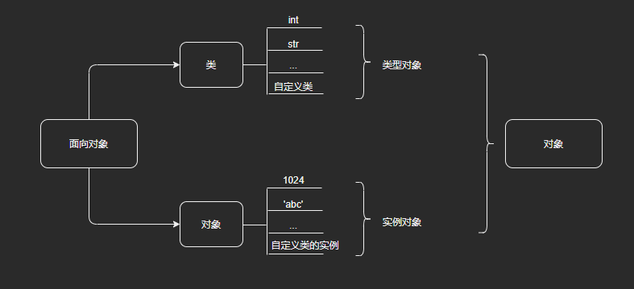
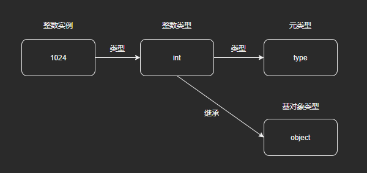
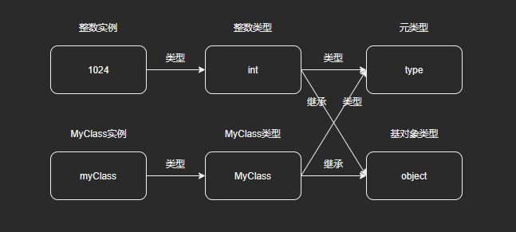
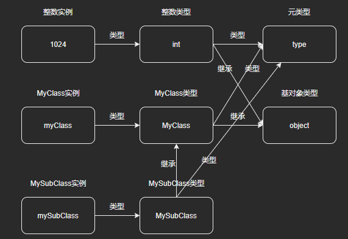
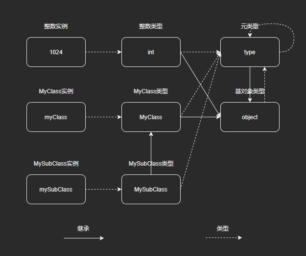
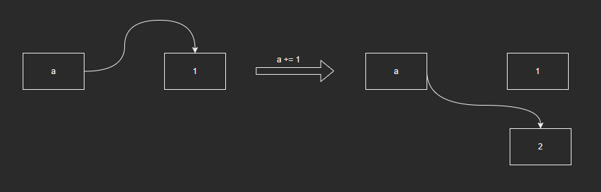
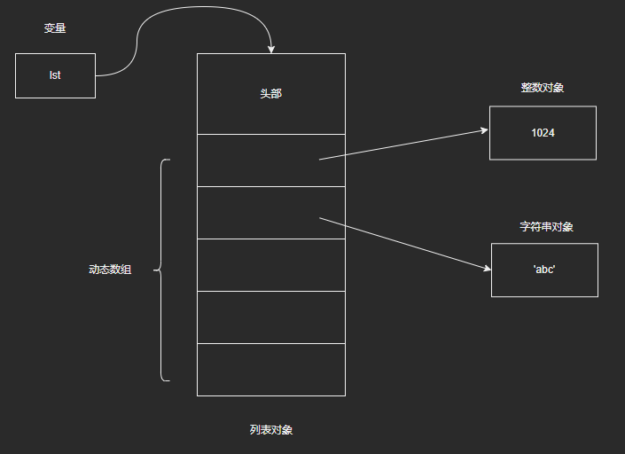

# 万物皆对象

注：本篇是根据教程学习记录的笔记，部分内容与教程是相同的，因为转载需要填链接，但是没有，所以填的原创，如果侵权会直接删除。

这篇博客的内容主要是针对Python中万物皆对象的理解，对Python的类型、对象体系做一个整体的梳理。

在Python中，一切皆为对象，一个整数是一个对象，一个字符串也是一个对象，基本类型（如int）也是对象。Python不再区别对待基本类型和对象，所有的基本类型内部均由对象实现。

```python
>>> a = int
>>> b = 1
>>> id(a)
140734789683952
>>> id(int)
140734789683952
>>> a
<class 'int'>
>>> id(b)
2421963817200
>>> id(1)
2421963817200
>>> b
1
```

## 1 类型对象和实例对象

- Python中的类型是一种对象，称为**类型对象**。整数类型、字符串类型，以及我们通过class关键字定义的自定义类型也是一个对象。
- 通过类实例化可以得到一个实例化对象，称为**实例对象**



## 2 类型、对象体系

### 2.1 元类型type

- 前面我们提到：Python中的类型是一种对象，称为类型对象。那么类型对象的类型又是什么呢？

  ```python
  >>> type(int)
  <class 'type'>
  >>> int.__class__
  <class 'type'>
  ```

- 可以看到，类型的类型是**type**，我们称之为**元类型**，但是这个类型比较特殊，它的实例对象是类型对象。此外，Python中还有一个特殊的类型**object**，所有其他类型都继承于object，即object是所有类型的基类。图示如下：

  

### 2.2 自定义类型

- 除了Python的内置类型，我们自定义一个类型MyClass，同样地，可以得到：

  

### 2.3 自定义类型子类

- 再定义一个类型MySubClass，该类型为MyClass的子类：

  

### 2.4 type和object的关系

- 在上述示例中，我们描述了不同对象、类型之间的继承、类型关系，但是对于两个特殊的类型type和object的关系并没有指出，我们先来打印看一下：

  ```python
  >>> type(type)
  <class 'type'>
  >>> type(object)
  <class 'type'>
  >>> type.__base__
  <class 'object'>
  >>> object.__base__
  >>> print(object.__base__)
  None
  ```

- 可以看到：object的类型也是type，type本身的类型也是type；而type的父类也是所有对象的父类——object，而object本身没有父类。由此我们可以归纳出：

  1. object是所有类型的基类（除了它自己），本质上是一种类型，其类型是type，同时也是type的基类；
  2. type是所有类型的类型，本质上是一种类型，其类型是它自己，也是object的类型；
  3. 注：object本身不能有基类，这是因为——对于存在继承关系的类，成员属性和成员方法查找需要回溯继承链，不断查找基类。因此，继承链必须有一个终点，不然就会死循环。

- 最后我们把type和object的关系补充进来：

  

## 3 可变对象与不可变对象

- 可变对象在创建之后，其值可以修改；不可变对象在创建之后，其值不可以进行修改。

- 以Python中的整数对象为例：整数类型是不可变类型，整数对象是不可变对象。“修改整数对象”时，Python将以新值创建一个新对象，变量名与新对象进行绑定，旧对象如果没有其他引用，则会被释放（通过“小整数池”进行创建回收优化，具体后续介绍，这里先按下不表，后续会补充）。图示如下：

  
  
- 以Python中的列表对象为例：列表类型是可变类型，列表对象是可变对象。列表对象内部会维护一个动态数组，存储元素对象的指针，列表对象再增减对象的时候，会修改该数组，而列表对象的“头部”（后续会详细介绍）会保持不变：

  

## 4 变长对象和定长对象

- 定长对象：对象的内存大小一定

- 边长对象：同一类型，不同对象会有不同的大小

- 通过sys.getsizeof()可以查看一个对象的大小：

  ```python
  >>> import sys
  >>> a = 1
  >>> b = 1111111111111111111111111111111111111111111111111111111111
  >>> c = 1.0
  >>> d = 1.00000000000000000000000000000000000000000000000000000001
  >>> sys.getsizeof(a)
  28
  >>> sys.getsizeof(b)
  52
  >>> sys.getsizeof(c)
  24
  >>> sys.getsizeof(d)
  24
  ```

- 整数对象是变长对象：固定位数的整数能够表示的范围是有限的，故整数对象会随着自身的数值大小而改变自身内存大小。在Python中采用了类似C++中大整数类的思路实现整数对象，通过串联多个普通32位整数来支持更大的数值范围（详细源码后续介绍）。

- 浮点数对象是定长对象：根据机组的知识，我们用32位表示单精度浮点数，用64位表示双精度浮点数，它们都是定长的。在Python中，浮点数背后是由一个double来实现的，就算表示很大的数，浮点数对象的大小也不变（这样做的代价是牺牲了精度）。当然，浮点数也是有大小限制的，可以思考下：我们通过float()将一个很大的int转化为float时，是否会报错？Python底层是否做了相应的判断呢？

## 5 补充

- 变量名：我们创建对象时会为对象分配对应的内存空间，那么我们将变量名和对象绑定时，变量又是如何存储的呢？详见“12-作用域与名字空间”。

