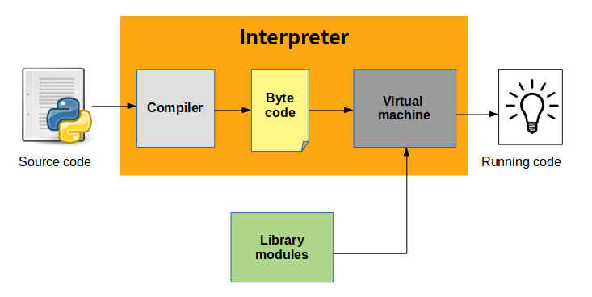
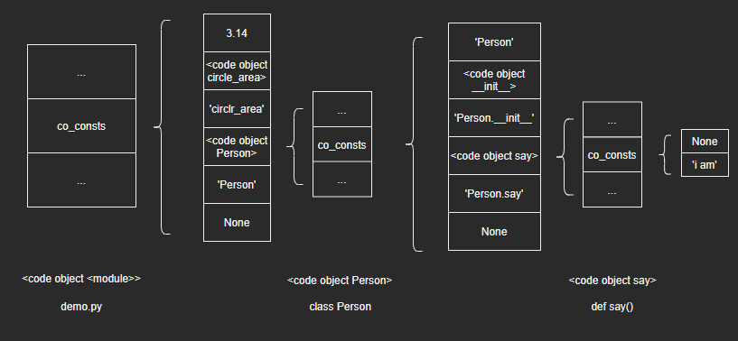
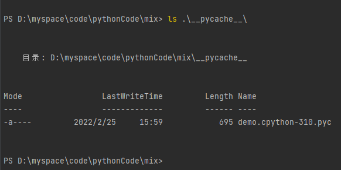

## Python程序执行过程与字节码

注：本篇是根据教程学习记录的笔记，部分内容与教程是相同的，因为转载需要填链接，但是没有，所以填的原创，如果侵权会直接删除。

问题：

我们每天都要编写一些Python程序，或者用来处理一些文本，或者是做一些系统管理工作。程序写好后，只需要敲下python命令，便可将程序启动起来并开始执行：

```
$ python some-program.py
```

那么，一个文本形式的.py文件，是如何一步步转换为能够被CPU执行的机器指令的呢？此外，程序执行过程中可能会有.pyc文件生成，这些文件又有什么作用呢？

### 1. 执行过程

虽然从行为上看Python更像Shell脚本这样的解释性语言，但实际上Python程序执行原理本质上跟Java或者C#一样，都可以归纳为**虚拟机**和**字节码**。Python执行程序分为两步：先将程序代码编译成字节码，然后启动虚拟机执行字节码：



虽然Python命令也叫做Python解释器，但跟其他脚本语言解释器有本质区别。实际上，Python解释器包含**编译器**以及**虚拟机**两部分。当Python解释器启动后，主要执行以下两个步骤：

1. 编译器将.py文件中的Python源码编译成字节码
2. 虚拟机逐行执行编译器生成的字节码

因此，.py文件中的Python语句并没有直接转换成机器指令，而是转换成Python字节码。

### 2. 字节码

Python程序的编译结果是字节码，里面有很多关于Python运行的相关内容。因此，不管是为了更深入理解Python虚拟机运行机制，还是为了调优Python程序运行效率，字节码都是关键内容。那么，Python字节码到底长啥样呢？我们如何才能获得一个Python程序的字节码呢——Python提供了一个内置函数compile用于及时编译源码。我们只需将待编译源码作为参数调用compile函数，即可获得源码的编译结果。

### 3. 源码编译

- 下面，我们通过compile函数来编译一个程序：

  1. 源码保存在demo.py文件中：

     ```python
     PI = 3.14
     
     def circle_area(r):
         return PI * r ** 2
     
     class Person(object):
         def __init__(self, name):
             self.name = name
     
         def say(self):
             print('i am', self.name)
     ```

  2. 编译之前需要将源码从文件中读取出来：

     ```python
     >>> text = open('D:\myspace\code\pythonCode\mix\demo.py').read()
     >>> print(text)
     PI = 3.14
     
     def circle_area(r):
         return PI * r ** 2
     
     class Person(object):
         def __init__(self, name):
             self.name = name
     
         def say(self):
             print('i am', self.name)
     ```

  3. 然后调用compile函数来编译源码：

     ```python
     >>> result = compile(text,'D:\myspace\code\pythonCode\mix\demo.py', 'exec')
     ```

     compile函数必填的参数有3个：

     - source：待编译源码

     - filename：源码所在文件名

     - mode：编译模式，exec表示将源码当作一个模块来编译

       三种编译模式：

       1. exec：用于编译模块源码
       2. single：用于编译一个单独的Python语句（交互式下）
       3. eval：用于编译一个eval表达式

### 4. PyCodeObject

- 通过compile函数，我们获得了最后的源码编译结果result：

  ```python
  >>> result
  <code object <module> at 0x000001DEC2FCF680, file "D:\myspace\code\pythonCode\mix\demo.py", line 1>
  >>> result.__class__
  <class 'code'>
  ```

  最终我们得到了一个code类型的对象，它对应的底层结构体是PyCodeObject

- PyCodeObject源码如下：

  ```python
  /* Bytecode object */
  struct PyCodeObject {
      PyObject_HEAD
      int co_argcount;            /* #arguments, except *args */
      int co_posonlyargcount;     /* #positional only arguments */
      int co_kwonlyargcount;      /* #keyword only arguments */
      int co_nlocals;             /* #local variables */
      int co_stacksize;           /* #entries needed for evaluation stack */
      int co_flags;               /* CO_..., see below */
      int co_firstlineno;         /* first source line number */
      PyObject *co_code;          /* instruction opcodes */
      PyObject *co_consts;        /* list (constants used) */
      PyObject *co_names;         /* list of strings (names used) */
      PyObject *co_varnames;      /* tuple of strings (local variable names) */
      PyObject *co_freevars;      /* tuple of strings (free variable names) */
      PyObject *co_cellvars;      /* tuple of strings (cell variable names) */
      /* The rest aren't used in either hash or comparisons, except for co_name,
         used in both. This is done to preserve the name and line number
         for tracebacks and debuggers; otherwise, constant de-duplication
         would collapse identical functions/lambdas defined on different lines.
      */
      Py_ssize_t *co_cell2arg;    /* Maps cell vars which are arguments. */
      PyObject *co_filename;      /* unicode (where it was loaded from) */
      PyObject *co_name;          /* unicode (name, for reference) */
      PyObject *co_linetable;     /* string (encoding addr<->lineno mapping) See
                                     Objects/lnotab_notes.txt for details. */
      void *co_zombieframe;       /* for optimization only (see frameobject.c) */
      PyObject *co_weakreflist;   /* to support weakrefs to code objects */
      /* Scratch space for extra data relating to the code object.
         Type is a void* to keep the format private in codeobject.c to force
         people to go through the proper APIs. */
      void *co_extra;
  
      /* Per opcodes just-in-time cache
       *
       * To reduce cache size, we use indirect mapping from opcode index to
       * cache object:
       *   cache = co_opcache[co_opcache_map[next_instr - first_instr] - 1]
       */
  
      // co_opcache_map is indexed by (next_instr - first_instr).
      //  * 0 means there is no cache for this opcode.
      //  * n > 0 means there is cache in co_opcache[n-1].
      unsigned char *co_opcache_map;
      _PyOpcache *co_opcache;
      int co_opcache_flag;  // used to determine when create a cache.
      unsigned char co_opcache_size;  // length of co_opcache.
  };
  ```

- 代码对象PyCodeObject用于存储编译结果，包括字节码以及代码涉及的常量、名字等等。关键字段包括：

  | 字段              | 用途                 |
  | ----------------- | -------------------- |
  | co_argcount       | 参数个数             |
  | co_kwonlyargcount | 关键字参数个数       |
  | co_nlocals        | 局部变量个数         |
  | co_stacksize      | 执行代码所需栈空间   |
  | co_flags          | 标识                 |
  | co_firstlineno    | 代码块首行行号       |
  | co_code           | 指令操作码，即字节码 |
  | co_consts         | 常量列表             |
  | co_names          | 名字列表             |
  | co_varnames       | 局部变量名列表       |

- 下面打印看一下这些字段对应的数据：

  - 通过co_code字段获得字节码：

    ```python
    >>> result.co_code
    b'd\x00Z\x00d\x01d\x02\x84\x00Z\x01G\x00d\x03d\x04\x84\x00d\x04e\x02\x83\x03Z\x03d\x05S\x00'
    ```

  - 通过co_names字段获得代码对象涉及的所有名字：

    ```python
    >>> result.co_names
    ('PI', 'circle_area', 'object', 'Person')
    ```

  - 通过co_consts字段获得代码对象涉及的所有常量：

    ```python
    >>> result.co_consts
    (3.14, <code object circle_area at 0x0000023D04D3F310, file "D:\myspace\code\pythonCode\mix\demo.py", line 3>, 'circle_area', <code object Person at 0x0000023D04D3F5D0, file "D:\myspace\code\pythonCode\mix\demo.py", line 6>, 'Person', None)
    ```

    可以看到，常量列表中还有两个代码对象，其中一个是circle_area函数体，另一个是Person类定义体。对应Python中**作用域**的划分方式，可以自然联想到：每个作用域对应一个代码对象。如果这个假设成立，那么Person代码对象的常量列表中应该还包括两个代码对象：init函数体和say函数体。下面取出Person类代码对象来看一下：

    ```python
    >>> person_code = result.co_consts[3]
    >>> person_code
    <code object Person at 0x0000023D04D3F5D0, file "D:\myspace\code\pythonCode\mix\demo.py", line 6>
    >>> person_code.co_consts
    ('Person', <code object __init__ at 0x0000023D04D3F470, file "D:\myspace\code\pythonCode\mix\demo.py", line 7>, 'Person.__init__', <code object say at 0x0000023D04D3F520, file "D:\myspace\code\pythonCode\mix\demo.py", line 10>, 'Person.say', None)
    ```

    因此，我们得出结论：Python源码编译后，每个作用域都对应着一个代码对象，子作用域代码对象位于父作用域代码对象的常量列表里，层级一一对应。

    

- 至此，我们对Python源码的编译结果——代码对象PyCodeObject有了最基本的认识，后续会在虚拟机、函数机制、类机制中进一步学习。

### 5. 反编译

- 字节码是一串不可读的字节序列，跟二进制机器码一样。如果想读懂机器码，可以将其反汇编，那么字节码可以反编译吗？

- 通过dis模块可以将字节码反编译：

  ```python
  >>> import dis
  >>> dis.dis(result.co_code)
   0 LOAD_CONST               0 (0)
   2 STORE_NAME               0 (0)
   4 LOAD_CONST               1 (1)
   6 LOAD_CONST               2 (2)
   8 MAKE_FUNCTION            0
  10 STORE_NAME               1 (1)
  12 LOAD_BUILD_CLASS
  14 LOAD_CONST               3 (3)
  16 LOAD_CONST               4 (4)
  18 MAKE_FUNCTION            0
  20 LOAD_CONST               4 (4)
  22 LOAD_NAME                2 (2)
  24 CALL_FUNCTION            3
  26 STORE_NAME               3 (3)
  28 LOAD_CONST               5 (5)
  30 RETURN_VALUE
  ```

  字节码反编译后的结果和汇编语言很类似。其中，第一列是字节码的偏移量，第二列是指令，第三列是操作数。以第一条字节码为例，LOAD_CONST指令将常量加载进栈，常量下标由操作数给出，而下标为0的常量是：

  ```python
  >>> result.co_consts[0]
  3.14
  ```

  这样，第一条字节码的意义就明确了：将常量3.14加载到栈。

- 由于代码对象保存了字节码、常量、名字等上下文信息，因此直接对代码对象进行反编译可以得到更清晰的结果：

  ```python
  >>>dis.dis(result)
    1           0 LOAD_CONST               0 (3.14)
                2 STORE_NAME               0 (PI)
  
    3           4 LOAD_CONST               1 (<code object circle_area at 0x0000023D04D3F310, file "D:\myspace\code\pythonCode\mix\demo.py", line 3>)
                6 LOAD_CONST               2 ('circle_area')
                8 MAKE_FUNCTION            0
               10 STORE_NAME               1 (circle_area)
  
    6          12 LOAD_BUILD_CLASS
               14 LOAD_CONST               3 (<code object Person at 0x0000023D04D3F5D0, file "D:\myspace\code\pythonCode\mix\demo.py", line 6>)
               16 LOAD_CONST               4 ('Person')
               18 MAKE_FUNCTION            0
               20 LOAD_CONST               4 ('Person')
               22 LOAD_NAME                2 (object)
               24 CALL_FUNCTION            3
               26 STORE_NAME               3 (Person)
               28 LOAD_CONST               5 (None)
               30 RETURN_VALUE
  
  Disassembly of <code object circle_area at 0x0000023D04D3F310, file "D:\myspace\code\pythonCode\mix\demo.py", line 3>:
    4           0 LOAD_GLOBAL              0 (PI)
                2 LOAD_FAST                0 (r)
                4 LOAD_CONST               1 (2)
                6 BINARY_POWER
                8 BINARY_MULTIPLY
               10 RETURN_VALUE
  
  Disassembly of <code object Person at 0x0000023D04D3F5D0, file "D:\myspace\code\pythonCode\mix\demo.py", line 6>:
    6           0 LOAD_NAME                0 (__name__)
                2 STORE_NAME               1 (__module__)
                4 LOAD_CONST               0 ('Person')
                6 STORE_NAME               2 (__qualname__)
  
    7           8 LOAD_CONST               1 (<code object __init__ at 0x0000023D04D3F470, file "D:\myspace\code\pythonCode\mix\demo.py", line 7>)
               10 LOAD_CONST               2 ('Person.__init__')
               12 MAKE_FUNCTION            0
               14 STORE_NAME               3 (__init__)
  
   10          16 LOAD_CONST               3 (<code object say at 0x0000023D04D3F520, file "D:\myspace\code\pythonCode\mix\demo.py", line 10>)
               18 LOAD_CONST               4 ('Person.say')
               20 MAKE_FUNCTION            0
               22 STORE_NAME               4 (say)
               24 LOAD_CONST               5 (None)
               26 RETURN_VALUE
  
  Disassembly of <code object __init__ at 0x0000023D04D3F470, file "D:\myspace\code\pythonCode\mix\demo.py", line 7>:
    8           0 LOAD_FAST                1 (name)
                2 LOAD_FAST                0 (self)
                4 STORE_ATTR               0 (name)
                6 LOAD_CONST               0 (None)
                8 RETURN_VALUE
  
  Disassembly of <code object say at 0x0000023D04D3F520, file "D:\myspace\code\pythonCode\mix\demo.py", line 10>:
   11           0 LOAD_GLOBAL              0 (print)
                2 LOAD_CONST               1 ('i am')
                4 LOAD_FAST                0 (self)
                6 LOAD_ATTR                1 (name)
                8 CALL_FUNCTION            2
               10 POP_TOP
               12 LOAD_CONST               0 (None)
               14 RETURN_VALUE
  ```

  操作数指定的常量或名字的实际值在旁边的括号内列出，此外，字节码以语句为单位进行了分组，中间以空行隔开，语句的行号在字节码前面给出。例如PI = 3.14这个语句就被会变成了两条字节码：

  ```python
    1           0 LOAD_CONST               0 (3.14)
                2 STORE_NAME               0 (PI)
  ```

### 6. pyc

- 如果将demo作为模块导入，Python将在demo.py文件所在目录下生成.pyc文件：

  ```python
  >>> import demo
  ```

  

- pyc文件会保存经过序列化处理的代码对象PyCodeObject。这样一来，Python后续导入demo模块时，直接读取pyc文件并反序列化即可得到代码对象，避免了重复编译导致的开销。只有demo.py有新修改（时间戳比.pyc文件新），Python才会重新编译。

- 因此，对比Java而言：Python中的.py文件可以类比Java中的.java文件，都是源码文件；而.pyc文件可以类比.class文件，都是编译结果。只不过Java程序需要先用编译器javac命令来编译，再用虚拟机java命令来执行；而Python解释器把这两个过程都完成了。
