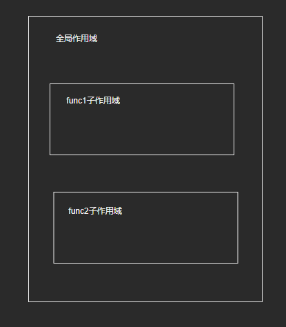
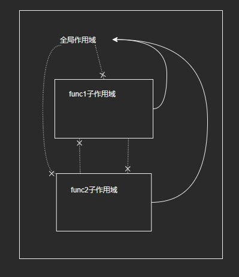
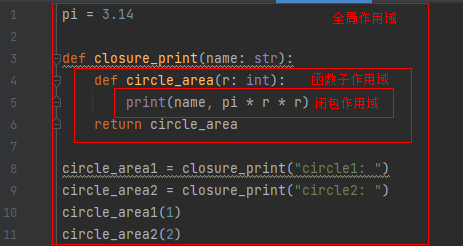

## 作用域与名字空间

注：本篇是根据教程学习记录的笔记，部分内容与教程是相同的，因为转载需要填链接，但是没有，所以填的原创，如果侵权会直接删除。

问题：

```python
PI = 3.14

def circle_area(r):
    return PI * r ** 2

class Person(object):
    def __init__(self, name):
        self.name = name

    def say(self):
        print('i am', self.name)
```

以这个程序为例，代码中出现的每个变量的**作用域**分别是什么？程序中总共涉及多少个**名字空间**？Python又以怎样的顺序去查找一个变量呢？

### 1. 名字绑定

#### 1.1 赋值

在Python中，变量只是一个与实际对象绑定起来的名字，变量定义本质上就是建立名字与对象的约束关系。因此，赋值语句本质上就是建立这样的约束关系，将右边的对象与左边的名字绑定起来：

```python
a = 1
```

赋值语句是最基本的将名字与对象绑定的方式，除此之外还有很多其他方式都起到了这样的作用。

#### 1.2 模块导入

当我们导入一个模块时，也会在当前上下文创建一个名字，并与被导入对象绑定。

```python
# 在当前上下文创建一个名字test，与被导入的module对象绑定
import test
```

#### 1.3 函数、类定义

```python
# 函数名circle_area与function对象绑定
def circle_area(r):
    return PI * r ** 2

# 类名Person与类型对象绑定
class Person(object):
    def __init__(self):
        pass
```

#### 1.4 as关键字

```python
# 将名字t与module对象绑定
import test as t
```

### 2. 作用域

问题：当我们引入一个名字之后，它的可见范围有多大呢？

```python
a = 1

def func1():
    print(a)  # 1

def func2():
    a = 2
    print(a)  # 2

print(a)  # 1
```

在不同的代码区域引入的名字，其影响范围是不一样的。第1行定义的a可以影响到func1，而func2中定义的a则不能。此外，一个名字可能会在多个代码区域中定义，但最终在某个代码区域中只能使用其中一个。

#### 2.1 静态作用域

一个名字能够施加影响的程序正文区域，便是该名字的**作用域**。在Python中，一个名字在程序中某个区域能否起作用，是由名字引入的位置决定的，而不是运行时动态决定的。因此，Python具有**静态作用域**，也称为词法作用域。那么，作用域具体是如何划分的呢？

#### 2.2 划分作用域

- Python在编译时，根据语法规则将代码划分为不同的**代码块**，每个代码块形成一个**作用域**。首先，整个.py文件构成最顶层的作用域，这就是**全局作用域**，也成为**模块作用域**；其次，当代码遇到**函数定义**，函数体成为当前作用域的**子作用域**；再者，当代码遇到**类定义**，类定义体成为当前作用域的子作用域。

- 一个名字在某个作用域引入后，它的影响范围就被限制在该作用域内。其中，全局作用域对所有直接或间接内嵌于其中的子作用域可见；函数作用域对其直接子作用域可见，并且可以传递。

- 例子中的作用域的嵌套关系如下：

  

  访问关系如下：

  

#### 2.3 闭包作用域

- 闭包的概念：在计算机科学中，闭包，又称词法闭包或函数闭包，是**引用了自由变量的函数**。这个被引用的自由变量将和这个函数一同存在，即使已经离开了创造它的环境也不例外。所以，有另一种说法认为闭包是由函数和与其相关的引用环境组合而成的实体。闭包在运行时可以有多个实例，不同的引用环境和相同的函数组合可以产生不同的实例

- 代码示例：

  ```python
  >>> pi = 3.14
  >>> def closure_print(name: str):
      	def circle_area(r: int):
          	print(name, pi * r * r)
  	    return circle_area
  
  >>> circle_area1 = closure_print("circle1: ")
  >>> circle_area2 = closure_print("circle2: ")
  >>> circle_area1(1)
  circle1:  3.14
  >>> circle_area2(2)
  circle2:  12.56
  ```

  划分作用域：

  

- 思考：circle_area1和circle_area2函数对象是怎么拿到name的？

#### 2.4 类作用域

- 代码示例：

  ```python
  >>> language = 'chinese'
  >>> class Male:
          gender: str = 'male'
          def __init__(self, name: str):
              self.name = name
          def Speak(self):
              print('i speak', language)
          def Gender(self):
              print('i am', gender)
  
          
  >>> male = Male('zhangsan')
  >>> male.Gender()
  Traceback (most recent call last):
    File "<pyshell#11>", line 1, in <module>
      male.Gender()
    File "<pyshell#9>", line 8, in Gender
      print('i am', gender)
  NameError: name 'gender' is not defined
  >>> male.Speak()
  i speak chinese
  ```

- 作用域分析：

  - 全局作用域对其他所有内嵌其中的作用域均可见，所以在函数Speak()中可以访问到language
  - 类作用域和函数作用域不一样，它对其子作用域是不可见的，所以在函数Gende()中gender是不可见的

- 思考：

  ```python
  >>> male.gender
  'male'
  >>> Male.gender
  'male'
  >>> male.gender = 'male2'
  >>> male.gender
  'male2'
  >>> Male.gender
  'male'
  ```

#### 2.5 复杂嵌套

##### 2.5.1 函数嵌套类

- 在Python中，类可以动态创建，甚至在函数中返回。通过在函数中创建并返回类，可以按函数参数对类进行动态定制

- 代码示例：

  ```python
  >>> language = 'chinese'
  
  >>> def MakeMale(sSortName: str):
          class Male:
              sortName = sSortName
  
              def __init__(self, name: str):
                  self.name = name
  
              def Speak(self):
                  print('i speak', language)
  
  			def Sort(self):
  				print(sSortName)
          return Male
  
  >>> ChineseMale: type = MakeMale('Chinese Men')
  >>> chineseMale = ChineseMale('zhangsan')
  >>> chineseMale.Speak()
  i speak chinese
  >>> chineseMale.sortName
  Chinese Men
  >>> chineseMale.Sort()
  Chinese Men
  ```

##### 2.5.2 类嵌套类

- 代码示例：

  ```python
  >>> class OutClass:
          inName = 'in'
          
          class InClass:
              name = inName
  
          
  Traceback (most recent call last):
    File "<pyshell#26>", line 1, in <module>
      class OutClass:
    File "<pyshell#26>", line 3, in OutClass
      class InClass:
    File "<pyshell#26>", line 4, in InClass
      name = inName
  NameError: name 'inName' is not defined
  ```

### 3. 名字空间

- 作用域是语法层面的概念，是静态的。当程序开始执行后，作用域中的名字绑定关系需要存储起来，存储的地方就是**名字空间**。由于名字绑定关系是由名字和对象组成的键值对，因此用dict是理想的存储容器（之前在介绍dict的相关内容时也有提到）

- 以计算圆面积的例子来认识作用域背后的运行时实体——名字空间。代码示例如下：

  ```python
  >>> PI = 3.14
  >>> def closure_print(name: str):
      	def circle_area(r: int):
          	print(name, PI * r * r)
  	    return circle_area
  ```

#### 3.1 Globals

- 在Python中，每个**模块**都有一个dict对象，用于存储**全局作用域**中的名字，这就是**全局名字空间Globals**。在上述的例子中，根据我们之前对作用域的划分，可以肯定全局名字空间中一定包含两个名字：PI和closure_print。

- 如果其他模块也需要使用PI或closure_print函数，就需要通过import语句将模块导入，导入后我们就可以获得一个模块对象：

  ```python
  # 假设我们在test.py中导入上述模块testglobal.py
  >>> import testglobal
  >>> testglobal
  <module 'testglobal' from 'D:\\myspace\\code\\pythonCode\\mix\\namespace\\testglobal.py'>
  >>> type(testglobal)
  <class 'module'>
  ```

- 通过内置函数dir()我们可以知道模块对象下有哪些属性可以访问：

  ```python
  >>> dir(testglobal)
  ['PI', '__builtins__', '__cached__', '__doc__', '__file__', '__loader__', '__name__', '__package__', '__spec__', 'closure_print']
  >>> testglobal.closure_print
  <function closure_print at 0x000002F33B14A050>
  ```

- 在Python中，一个对象可以访问哪些属性，成为对象的**属性空间**。因此，模块的属性空间和全局名字空间本质上就是同一个东西，都通过一个dict对象进行存储。那么如何找到这个dict对象呢——通过\_\_dict\_\_属性：

  ```python
  >>> testglobal.__dict__
  ```

  此外，我们也可以通过内置函数globals()来获取当前模块的全局名字空间：
  
  ```python
  >>> globals()
  ```
  
  我们分别打印它们的id，本质上就是同一个对象：
  
  ```python
  >>> id(testglobal.__dict__)
  2219833831040
  >>> id(globals())
  2219833831040
  ```

#### 3.2 Locals

- Python执行一个作用域内的代码时，需要一个容器来访问当前作用域的名字，这就是**局部名字空间Locals**

- 当Python执行closure_print()函数时，将分配一个栈帧对象PyFrameObject来保存上下文信息以及执行状态。作为代码执行时必不可少的上下文信息，全局名字空间和局部名字空间也会在PyFrameObject上记录：

  ```python
  struct _frame {
      PyObject_VAR_HEAD
      struct _frame *f_back;      /* previous frame, or NULL */
      PyCodeObject *f_code;       /* code segment */
      PyObject *f_builtins;       /* builtin symbol table (PyDictObject) */
      PyObject *f_globals;        /* global symbol table (PyDictObject) */
      PyObject *f_locals;         /* local symbol table (any mapping) */
      PyObject **f_valuestack;    /* points after the last local */
      PyObject *f_trace;          /* Trace function */
      int f_stackdepth;           /* Depth of value stack */
      char f_trace_lines;         /* Emit per-line trace events? */
      char f_trace_opcodes;       /* Emit per-opcode trace events? */
  
      /* Borrowed reference to a generator, or NULL */
      PyObject *f_gen;
  
      int f_lasti;                /* Last instruction if called */
      int f_lineno;               /* Current line number. Only valid if non-zero */
      int f_iblock;               /* index in f_blockstack */
      PyFrameState f_state;       /* What state the frame is in */
      PyTryBlock f_blockstack[CO_MAXBLOCKS]; /* for try and loop blocks */
      PyObject *f_localsplus[1];  /* locals+stack, dynamically sized */
  };
  ```


#### 3.3 Enclosings

- 在作用域存在嵌套的情况下，Python将内层代码块依赖的所有外层名字存储在一个容器内，这就是**闭包名字空间Enclosings**

- 对于示例：

  ```python
  >>> pi = 3.14
  >>> def closure_print(name: str):
      	def circle_area(r: int):
              name = 1
          	print(name, pi * r * r)
  	    return circle_area
  ```
  
  当Python执行到print(name, pi * r * r)语句时，按照Locals、Enclosings、Globals这样的顺序查找语句中涉及的名字：名字name在Enclosings中找到，名字pi在Globals中找到，名字r在Locals中找到。那么还有一个名字print是如何找到的呢？

#### 3.4 Builtin

- Python在builtin模块中提供了很多内建函数和类型，构成运行时的另一个名字空间：**内建名字空间Builtin**

- 全局名字空间中有一个名字指向内建名字空间：

  ```python
  >>> import builtins
  >>> id(testglobal.__builtins__)
  3065787874688
  >>> id(builtins.__dict__)
  3065787874688
  ```


### 4. 问题与总结

- 函数作用域对内部所有的作用域均可见，包括内部嵌套的类作用域和函数作用域（例如闭包）；类作用域对内部所有的作用域均不可见，包括内部嵌套的类作用域和函数作用域。

- “只要在当前Locals命名空间中无同名变量且没有global，nonlocal等关键字的声明的话，就一定创建一个该名字的新局部变量”，以nonlocal的使用为例：

  示例1：

  ```python
  >>> def closure_print(name: str):
          def circle_area(r: int):
              print(locals())
              print(name, PI * r * r)
          return circle_area
  >>> c = closure_print('circle1')
  >>> c(1)
  {'r': 1, 'name': 'circle1'}
  circle1 3.14
  ```

  示例2：

  ```python
  >>> PI = 3.14
  >>> def closure_print(name: str):
          def circle_area(r: int):
              print(locals())
              name += '1'
              print(name, PI * r * r)
          return circle_area
  >>> c = closure_print('circle1')
  >>> c(1)
  {'r': 1}
  Traceback (most recent call last):
    File "<pyshell#4>", line 1, in <module>
      c(1)
    File "<pyshell#2>", line 4, in circle_area
      name += '1'
  UnboundLocalError: local variable 'name' referenced before assignment
  ```

  示例3：

  ```python
  >>> PI = 3.14
  >>> def closure_print(name: str):
          def circle_area(r: int):
              print(locals())
              name = 'circle2'
              print(locals())
              print(name, PI * r * r)
          return circle_area
  >>> c = closure_print('circle1')
  >>> c(1)
  {'r': 1}
  {'r': 1, 'name': 'circle2'}
  circle2 3.14
  ```

  示例4：

  ```python
  >>> PI = 3.14
  >>> def closure_print(name: str):
          def circle_area(r: int):
              print(locals())
              nonlocal name
              name += '1'
              print(locals())
              print(name, PI * r * r)
          return circle_area
  >>> c = closure_print('circle1')
  >>> c(1)
  {'r': 1, 'name': 'circle1'}
  {'r': 1, 'name': 'circle11'}
  circle11 3.14
  ```

- locals()输出的到底是什么？C源码如下：

  ```python
  int
  PyFrame_FastToLocalsWithError(PyFrameObject *f)
  {
      /* Merge fast locals into f->f_locals */
      PyObject *locals, *map;
      PyObject **fast;
      PyCodeObject *co;
      Py_ssize_t j;
      Py_ssize_t ncells, nfreevars;
  
      if (f == NULL) {
          PyErr_BadInternalCall();
          return -1;
      }
      // 初始赋值locals为f->f_locals
      locals = f->f_locals;
      if (locals == NULL) {
          locals = f->f_locals = PyDict_New();
          if (locals == NULL)
              return -1;
      }
      // 获取对应的PyCodeObject
      co = f->f_code;
      // 获取co_varnames字段
      map = co->co_varnames;
      if (!PyTuple_Check(map)) {
          PyErr_Format(PyExc_SystemError,
                       "co_varnames must be a tuple, not %s",
                       Py_TYPE(map)->tp_name);
          return -1;
      }
      fast = f->f_localsplus;
      j = PyTuple_GET_SIZE(map);
      if (j > co->co_nlocals)
          j = co->co_nlocals;
      if (co->co_nlocals) {
          // 将co_varnames加入到locals中
          if (map_to_dict(map, j, locals, fast, 0) < 0)
              return -1;
      }
      // 闭包相关
      ncells = PyTuple_GET_SIZE(co->co_cellvars);
      nfreevars = PyTuple_GET_SIZE(co->co_freevars);
      if (ncells || nfreevars) {
          // 将co_cellvars加入到locals
          if (map_to_dict(co->co_cellvars, ncells,
                          locals, fast + co->co_nlocals, 1))
              return -1;
  
          /* If the namespace is unoptimized, then one of the
             following cases applies:
             1. It does not contain free variables, because it
                uses import * or is a top-level namespace.
             2. It is a class namespace.
             We don't want to accidentally copy free variables
             into the locals dict used by the class.
          */
          if (co->co_flags & CO_OPTIMIZED) {
              // 将co_freevars加入到locals
              if (map_to_dict(co->co_freevars, nfreevars,
                              locals, fast + co->co_nlocals + ncells, 1) < 0)
                  return -1;
          }
      }
      return 0;
  }
  ```
