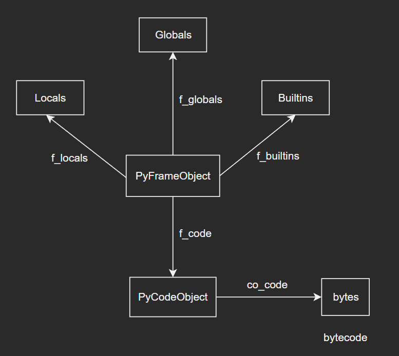
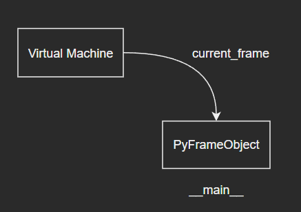
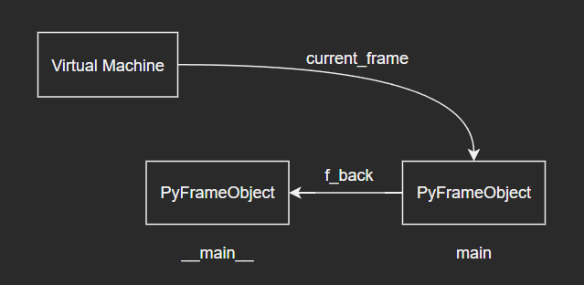
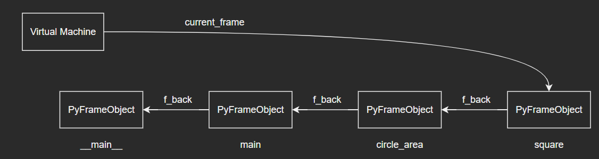

## Python虚拟机

注：本篇是根据教程学习记录的笔记，部分内容与教程是相同的，因为转载需要填链接，但是没有，所以填的原创，如果侵权会直接删除。此外，本篇内容大部分都咨询了ChatGPT，为笔者解决了很多问题。

问题：

在“11-Python程序执行过程与字节码中，我们研究了Python程序的编译过程：通过Python解释器中的编译器对 Python 源码进行编译，最终获得代码对象 PyCodeObject 。编译器根据语法规则对源码进行作用域的划分，并以此为单位来编译源码，最终为每个作用域生成一个代码对象。代码对象则保存了字节码，以及相关名字、常量等静态上下文信息。

`上面这段话是原文章的作者总结的，我个人觉得还是很到位的，大家也可以再回顾一下这篇笔记的内容：“11-Python程序执行过程与字节码”，更深刻体会下`

那么当我们得到了编译产出的代码对象后，虚拟机是如何解析并执行其中的字节码指令的呢？与语法作用域相对应的运行时名字空间，在虚拟机中又是如何动态维护的呢？

### 1. 栈帧对象

#### 1.1 PyFrameObject

- 当 Python 解释器加载一个模块或者执行函数时，会为对应的 PyCodeObject 创建一个 PyFrameObject 对象，并将其压入 Python 解释器的执行栈中。PyFrameObject 对象表示函数调用的栈帧对象，它包含了函数调用时的所有状态信息，包括局部变量、栈、当前指令等信息。

- 具体地我们来看一下执行上下文的具体结构——PyFrameObject，源码如下：

  ```c
  typedef struct _frame {
      PyObject_VAR_HEAD
      struct _frame *f_back;      /* previous frame, or NULL */
      PyCodeObject *f_code;       /* code segment */
      PyObject *f_builtins;       /* builtin symbol table (PyDictObject) */
      PyObject *f_globals;        /* global symbol table (PyDictObject) */
      PyObject *f_locals;         /* local symbol table (any mapping) */
      PyObject **f_valuestack;    /* points after the last local */
      /* Next free slot in f_valuestack.  Frame creation sets to f_valuestack.
         Frame evaluation usually NULLs it, but a frame that yields sets it
         to the current stack top. */
      PyObject **f_stacktop;
      PyObject *f_trace;          /* Trace function */
      char f_trace_lines;         /* Emit per-line trace events? */
      char f_trace_opcodes;       /* Emit per-opcode trace events? */
  
      /* Borrowed reference to a generator, or NULL */
      PyObject *f_gen;
  
      int f_lasti;                /* Last instruction if called */
      /* Call PyFrame_GetLineNumber() instead of reading this field
         directly.  As of 2.3 f_lineno is only valid when tracing is
         active (i.e. when f_trace is set).  At other times we use
         PyCode_Addr2Line to calculate the line from the current
         bytecode index. */
      int f_lineno;               /* Current line number */
      int f_iblock;               /* index in f_blockstack */
      char f_executing;           /* whether the frame is still executing */
      PyTryBlock f_blockstack[CO_MAXBLOCKS]; /* for try and loop blocks */
      PyObject *f_localsplus[1];  /* locals+stack, dynamically sized */
  } PyFrameObject;
  ```

  源码分析（只列出重要字段）：

  - f_back：表示**当前栈帧的前一个栈帧**，即**调用当前函数的函数的栈帧**。Python解释器使用这个字段来实现函数调用的递归和返回。如果当前函数是最外层函数，即没有调用它的函数，则该字段为NULL。
  - f_code：表示**当前栈帧对应的 PyCodeObject 对象**，即当前函数的字节码和相关信息。Python 解释器使用这个字段来执行函数中的字节码指令。
  - f_builtins：表示当前栈帧的内建变量字典，即当前函数中访问的所有内建函数和对象的名称和值。Python 解释器使用这个字段来实现对内建函数和对象的访问。
  - f_locals：表示当前栈帧的局部变量字典，即当前函数的所有局部变量的名称和值。Python 解释器使用这个字段来实现变量的读取和写入操作。
  - f_lasti：表示当前栈帧执行的最后一条指令的指令码在字节码序列中的索引。Python 解释器使用这个字段来记录当前函数执行的进度，以便在函数被中断或者函数返回时，能够恢复到正确的执行位置。
  - f_lineno：表示当前栈帧执行的源代码行号。Python 解释器使用这个字段来跟踪当前函数的行号，以便在发生异常时能够提供更准确的错误信息。
  - f_localsplus：表示当前栈帧的栈顶指针，即当前函数调用的栈的顶部。Python 解释器使用这个字段来实现函数调用的参数传递和返回值传递。

  思考：PyFrameObject为什么没有记录闭包信息？

  - PyFrameObject 对象本身不记录闭包相关的信息是出于设计上的考虑。一个主要的原因是为了保持执行栈的简洁性和高效性。
  - 闭包是一种在 Python 中广泛使用的编程模式，但是它在实现上是比较复杂的。在解释器执行 Python 代码时，一个函数在定义时可能没有引用外部变量，但是在运行时却可能引用了。因此，如果要记录函数中使用的外部变量，就需要在运行时动态地创建一个闭包对象，并将其与函数对象关联起来。这就会给执行栈的实现带来很大的复杂性。
  - 另一个原因是，闭包可能会被频繁地创建和销毁，而在执行栈中保存大量的闭包信息会导致执行效率变慢，甚至可能引起内存泄漏。因此，Python 解释器在设计执行栈时，选择不记录闭包相关的信息，以保持执行栈的简洁性和高效性。
  - 虽然 PyFrameObject 对象本身不记录闭包相关的信息，但是 Python 解释器可以通过其他方式来获取函数的闭包信息，例如通过函数对象的 **closure** 属性。

- PyFrameObject结构图如下：

  

- 其中，f_code字段保存了当前执行的代码对象，最核心的字节码就在代码对象中。而f_lasti字段则保存着上条已执行字节码的编号。虚拟机内部用一个C局部变量next_instr维护下条字节码的位置，并据此加载下一条待执行的字节码指令，原理和CPU的指令指针寄存器（%rip）一样。

- 另外，注意到f_back字段执行前一个栈帧对象，也就是调用者的栈帧对象。这样一来，栈帧对象按照调用关系串成一个调用链。（这里和x86CPU栈帧布局是如出一辙的，原作者在这里介绍了x86CPU栈帧布局与函数调用之间的关系，笔者能力有限就不介绍了，大家感兴趣的可以自行查找相关资料（主要还是微机原理和汇编学的不是很好。。。））

#### 1.2 栈帧对象链

- 现在，我们以具体例子来考察Python栈帧对象链以及函数调用之间的关系：

  ```python
  pi = 3.14
  
  def square(r):
      return r ** 2
  
  def circle_area(r):
      return pi * square(r)
  
  def main():
      print(circle_area(5))
  
  if __name__ == '__main__':
      main()
  ```

- 当Python开始执行这个程序时，虚拟机先创建一个栈帧对象，用于执行模块代码对象：

  

- 当虚拟机执行到模块代码第13行时，发生了函数调用。这是，虚拟机会新建一个栈帧对象，并开始执行函数main()的代码对象：

  

- 随着函数调用逐层深入，当调用square()函数时，调用链达到最长：

  

- 当函数调用完毕后，虚拟机通过f_back字段找到前一个栈帧对象并回到调用者代码中继续执行。

#### 1.3 栈帧获取

- 栈帧对象PyFrameObject中保存着Python运行时信息，在底层执行流控制以及程序调试中非常有用。在Python代码层面，我们可以通过sys模块中的_getframe()函数，即可获得当前栈帧对象：

  ```python
  >>> import sys
  >>> frame = sys._getframe()
  >>> frame
  <frame at 0x00000183FA78F870, file '<pyshell#1>', line 1, code <module>>
  >>> dir(frame)
  ['__class__', '__delattr__', '__dir__', '__doc__', '__eq__', '__format__', '__ge__', '__getattribute__', '__gt__', '__hash__', '__init__', '__init_subclass__', '__le__', '__lt__', '__ne__', '__new__', '__reduce__', '__reduce_ex__', '__repr__', '__setattr__', '__sizeof__', '__str__', '__subclasshook__', 'clear', 'f_back', 'f_builtins', 'f_code', 'f_globals', 'f_lasti', 'f_lineno', 'f_locals', 'f_trace', 'f_trace_lines', 'f_trace_opcodes']
  ```
  
- 拿到栈帧对象之后，我们来具体看一下相关的属性值，以之前的求面积的函数为例：

  ```python
  >>> import sys
  >>> pi = 3.14
  >>> def square(r):
          frame = sys._getframe()
          while frame:
              print('name:', frame.f_code.co_name)
              print('Locals', list(frame.f_locals.keys()))
              print('Globals', list(frame.f_globals.keys()))
              print('===========')
              frame = frame.f_back
          return r ** 2
  
  >>> def circle_area(r):
      	return pi * square(r)
  
  >>> def main():
      	print(circle_area(2))
  
  >>> if __name__ == '__main__':
      	main()
  
  name: square
  Locals ['r', 'frame']
  Globals ['__name__', '__doc__', '__package__', '__loader__', '__spec__', '__annotations__', '__builtins__', '__file__', '__cached__', 'sys', 'pi', 'square', 'circle_area', 'main']
  ===========
  name: circle_area
  Locals ['r']
  Globals ['__name__', '__doc__', '__package__', '__loader__', '__spec__', '__annotations__', '__builtins__', '__file__', '__cached__', 'sys', 'pi', 'square', 'circle_area', 'main']
  ===========
  name: main
  Locals []
  Globals ['__name__', '__doc__', '__package__', '__loader__', '__spec__', '__annotations__', '__builtins__', '__file__', '__cached__', 'sys', 'pi', 'square', 'circle_area', 'main']
  ===========
  name: <module>
  Locals ['__name__', '__doc__', '__package__', '__loader__', '__spec__', '__annotations__', '__builtins__', '__file__', '__cached__', 'sys', 'pi', 'square', 'circle_area', 'main']
  Globals ['__name__', '__doc__', '__package__', '__loader__', '__spec__', '__annotations__', '__builtins__', '__file__', '__cached__', 'sys', 'pi', 'square', 'circle_area', 'main']
  ===========
  12.56
  ```
  
- 小拓展：自定义函数实现sys._getframe()功能：（`这里是原作者举的一个例子，个人感觉对相关知识的理解是有帮助的`）

  - 当Python程序抛出异常时，会将执行上下文带出来，保存在异常中：

    ```python
    >>> try:
            1 / 0
        except Exception as e:
            print(e.__traceback__.tb_frame)
    
    <frame at 0x000002440D95BC50, file '<pyshell#5>', line 4, code <module>>
    ```
    
    因此，我们可以自定义一个getframe()函数：
    
    ```python
    >>> def getframe():
            try:
                1 / 0
            except Exception as e:
                return e.__traceback__.tb_frame.f_back
    ```
    
    注意：getframe()中通过异常获得的是自己的栈帧对象e.\_\_traceback\_\_.tb\_frame，所以还需要通过f_back字段找到调用者的栈帧。

### 2. 字节码执行（略）

Python 虚拟机执行代码对象的主要函数有两个：

- PyEval_EvalCodeEx() 是通用接口，一般用于函数这样带参数的执行场景：

  ```c
  PyObject *
  PyEval_EvalCodeEx(PyObject *_co, PyObject *globals, PyObject *locals,
                    PyObject *const *args, int argcount,
                    PyObject *const *kws, int kwcount,
                    PyObject *const *defs, int defcount,
                    PyObject *kwdefs, PyObject *closure);
  ```

- PyEval_EvalCode() 是更高层封装，用于模块等无参数的执行场景：

  ```c
  PyObject *
  PyEval_EvalCode(PyObject *co, PyObject *globals, PyObject *locals);
  ```

- 这两个函数最终调用 \_PyEval\_EvalCodeWithName() 函数，初始化栈帧对象并调用 PyEval_EvalFrame 系列函数进行处理。栈帧对象将贯穿代码对象执行的始终，负责维护执行时所需的一切上下文信息。而PyEval_EvalFrame 系列函数最终调用 \_PyEval\_EvalFrameDefault() 函数，虚拟机执行的核心就在这里（具体源码这里就不讲解了）。

  ```c
  PyObject *
  PyEval_EvalFrame(PyFrameObject *f);
  
  PyObject *
  PyEval_EvalFrameEx(PyFrameObject *f, int throwflag);
  
  PyObject* _Py_HOT_FUNCTION
  _PyEval_EvalFrameDefault(PyFrameObject *f, int throwflag);
  ```

- 文章后续以顺序执行、if判断、while循环详细讲解了字节码的执行过程，这里笔者就不赘述了。

