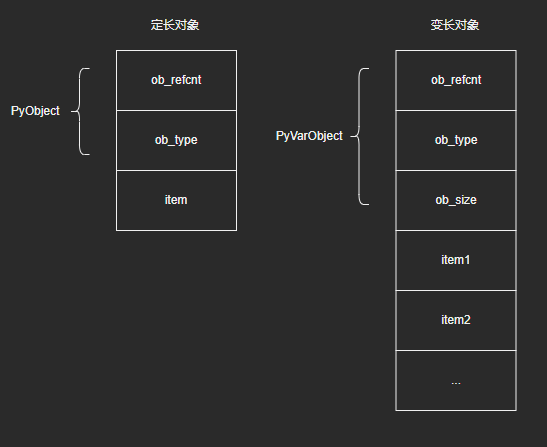
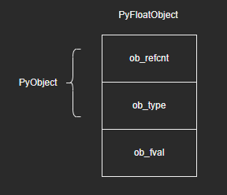
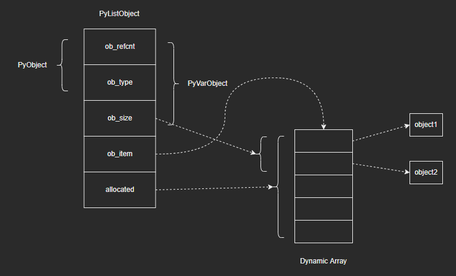
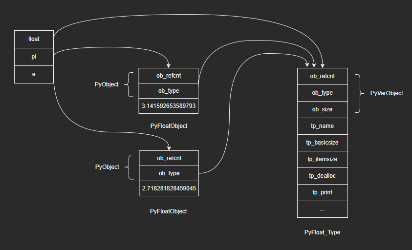
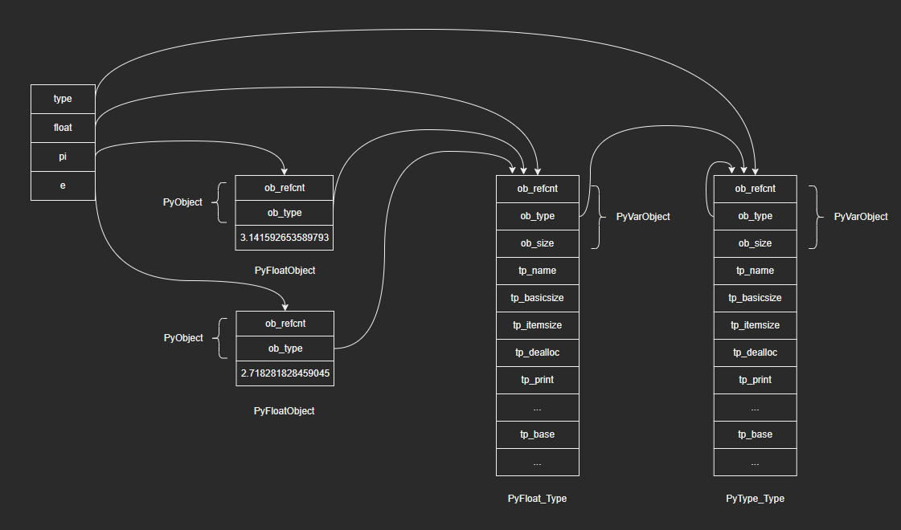
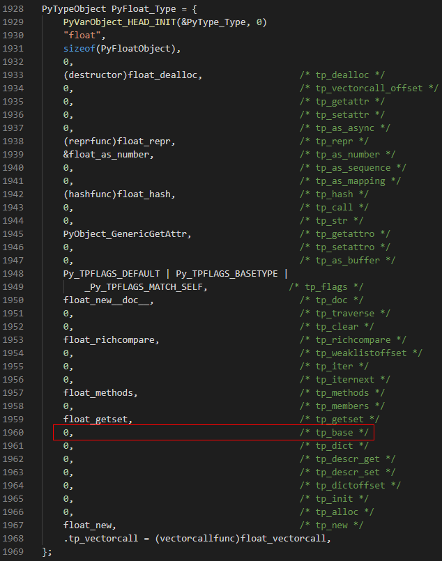
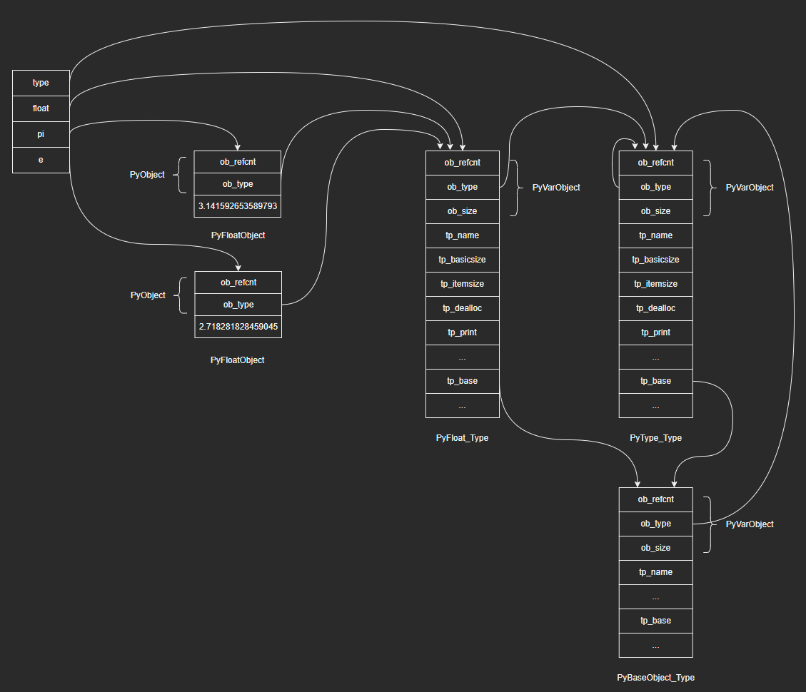

# Python对象的底层实现

注：本篇是根据教程学习记录的笔记，部分内容与教程是相同的，因为转载需要填链接，但是没有，所以填的原创，如果侵权会直接删除。

在“万物皆对象”中，我们对Python的对象类型体系有了一定的认识，这篇博客将从源码层面来介绍Python中万物皆对象的底层实现。

## 1. PyObject：对象的基石

- 在Python解释器的C层面，一切对象都是以PyObject为基础的

- C源码如下：

  ```c
  typedef struct _object {
      _PyObject_HEAD_EXTRA
      Py_ssize_t ob_refcnt;
      PyTypeObject *ob_type;
  } PyObject;
  ```
  
- 源码解读：

  - _PyObject_HEAD_EXTRA：主要用于实现双向链表（分析源码时暂时忽略）
  - ob_refcnt：引用计数，用于垃圾回收机制，当这个参数减少为0时即代表对象要被删除了（Py_ssize_t当作int或long即可，感兴趣的话可以去看下它的定义）
  - ob_type：类型指针，指向对象的类型对象（PyTypeObject，稍后介绍），类型对象描述实例对象的数据及行为。如PyLongObject的ob_type指向的就是PyLong_Type

## 2. PyVarObject：变长对象的基础

- PyVarObject与PyObject相比只多了一个属性ob_size，它指明了边长对象中有多少个元素

- C源码如下：

  ```c
  typedef struct {
      PyObject ob_base;
      Py_ssize_t ob_size; /* Number of items in variable part */
  } PyVarObject;
  ```

- 定长对象和变长对象的大致结构图示如下：

  

- 宏定义：对于具体对象，视其大小是否固定，需要包含头部PyObject或PyVarObject，为此，头文件准备了两个宏定义，方便其他对象使用：

  ```c
  #define PyObject_HEAD       PyObject ob_base;
  #define PyObject_VAR_HEAD   PyVarObject ob_base;
  ```

### 2.1 浮点对象

- 这里简单的以浮点对象作为定长对象的例子，介绍一下相关概念，后续会详细分析float对象的源码。

- 对于大小固定的浮点对象，需要在PyObject头部的基础上，用一个双精度浮点数double加以实现：

  ```c
  typedef struct {
      PyObject_HEAD
      double ob_fval;
  } PyFloatObject;
  ```

- 图示如下：

  

### 2.2 列表对象

- 这里简单的以列表对象作为变长对象的例子，介绍一下相关概念，后续会详细分析list对象的源码。

- 对于大小不固定的列表对象，需要在PyVarObject头部的基础上，用一个动态数组加以实现，数组存储了列表包含的对象的指针，即PyObject指针：

  ```c
  typedef struct {
      PyObject_VAR_HEAD
      PyObject **ob_item;
      Py_ssize_t allocated;
  } PyListObject;
  ```

- 源码解读：

  - ob_item：指向动态数组的指针，数组中保存元素对象指针
  - allocated：动态数组的总长度，即列表当前的“容量”
  - ob_size：当前元素个数，即列表当前的长度（这里的长度是指：列表包含n个元素，则长度为n）

- 图示如下：

  

## 3. PyTypeObject：类型的基石

问题：不同类型的对象所需存储空间不同，创建对象时从哪得知存储信息呢？以及如何判断一个给定对象支持哪些操作呢？

- 注意到，PyObject结构体中包含一个指针ob_type，指向的就是类型对象，其中就包含了上述问题所需要的信息

- C源码如下：（只列出了部分，后续会结合具体类型进行分析）

  ```c
  typedef struct _typeobject {
      PyObject_VAR_HEAD
      const char *tp_name; /* For printing, in format "<module>.<name>" */
      Py_ssize_t tp_basicsize, tp_itemsize; /* For allocation */
      /* Methods to implement standard operations */
      destructor tp_dealloc;
      printfunc tp_print
      getattrfunc tp_getattr;
      setattrfunc tp_setattr;
      // ...
      /* Attribute descriptor and subclassing stuff */
      PyObject *tp_bases;
  	// ...
  } PyTypeObject;
  ```

- 源码解读：

  - PyObject_VAR_HEAD表示PyTypeObject是变长对象
  - tp_name：类型名称
  - tp_basicsize、tp_itemsize：创建实例对象时所需的内存信息
  - tp_print、tp_getattr等：表示该类型支持的相关操作信息
  - tp_bases：指向基类对象，表示类型的继承信息

- PyTypeObject就是类型对象在C层面的表示形式，对应面向对象中”类“的概念，其中保存着对象的”元信息“（即一类对象的操作、数据等）。下面以浮点类型为例，列出了PyFloatObject和PyTypeObject之间的关系结构图示：（其中两个浮点实例对象都是PyFloatObject结构体，浮点类型对象float是一个PyTypeObject结构体变量）

  

- 由于浮点类型对象唯一，在C语言层面作为一个全局变量静态定义即可。C源码如下：（只列出了部分）

  ```c
  PyTypeObject PyFloat_Type = {
      PyVarObject_HEAD_INIT(&PyType_Type, 0)
      "float",
      sizeof(PyFloatObject),
      0,
      (destructor)float_dealloc,                  /* tp_dealloc */
      // ...
      (reprfunc)float_repr,                       /* tp_repr */
      // ...
  };
  ```

- 源码解读：

  - 第二行PyVarObject_HEAD_INIT(&PyType_Type, 0)：初始化了ob_refcnt、ob_type、ob_sie三个字段，其中ob_type指向了PyType_Type（稍后会继续介绍，它就是type），即：float的类型是type
  - 第三行"float"：将tp_name字段初始化为类型名称float

## 4. PyType_Type：类型的类型

- 通过PyFloat_Type的ob_type字段，我们找到了type所对应的C语言层面结构体变量：PyType_Type，C源码如下：（只列出了部分）

  ```c
  PyTypeObject PyType_Type = {
      PyVarObject_HEAD_INIT(&PyType_Type, 0)
      "type",                                     /* tp_name */
      sizeof(PyHeapTypeObject),                   /* tp_basicsize */
      sizeof(PyMemberDef),                        /* tp_itemsize */
      (destructor)type_dealloc,                   /* tp_dealloc */
      // ...
      (reprfunc)type_repr,                        /* tp_repr */
      // ...
  };
  ```

- 内建类型和自定义类对应的PyTypeObject对象都是通过这个PyType_Type创建的。在第二行PyVarObject_HEAD_INIT(&PyType_Type, 0)中，PyType_Type把自己的ob_type字段设置成了它自己，即type的类型是type

- 把PyType_Type加入到结构图中，图示如下：

  

## 5. PyBaseObject_Type：类型之基

- object是另外一个特殊的类型，它是所有类型的基类。如果要找到object对应的结构体，我们可以通过PyFloat_Type的tp_base字段来寻找，因为它指向的就是float的基类object。但是我们查看源码发现，PyFloat_Type中并没有初始化tp_base字段：

  

- 同样地，我们查看Objects文件夹下的各种不同类型所对应的结构体，发现tp_base字段均没有初始化，于是寻找将tp_base字段初始化的函数：

  ```c
  void
  _Py_ReadyTypes(void)
  {
      if (PyType_Ready(&PyBaseObject_Type) < 0)
          Py_FatalError("Can't initialize object type");
  
      if (PyType_Ready(&PyType_Type) < 0)
          Py_FatalError("Can't initialize type type");
  
      // ...
  
      if (PyType_Ready(&PyFloat_Type) < 0)
          Py_FatalError("Can't initialize float type");
  
      // ...
  }
  ```

  _Py_ReadyTypes中统一调用了PyType_Ready()函数，为各种类型设置tp_base字段：

  ```c
  int
  PyType_Ready(PyTypeObject *type)
  {
      // ...
  
      /* Initialize tp_base (defaults to BaseObject unless that's us) */
      base = type->tp_base;
      if (base == NULL && type != &PyBaseObject_Type) {
          base = type->tp_base = &PyBaseObject_Type;
          Py_INCREF(base);
      }
      
      // ...
  }
  ```

  可以看到，PyType_Ready在初始化tp_base字段时，对于PyBaseObject_Type，不会设置tp_base字段，即object是没有基类的，这就是为了保证继承链有一个终点。

- PyBaseObject_Type源码如下：（只列出了部分）

  ```c
  PyTypeObject PyBaseObject_Type = {
      PyVarObject_HEAD_INIT(&PyType_Type, 0)
      "object",                                   /* tp_name */
      sizeof(PyObject),                           /* tp_basicsize */
      0,                                          /* tp_itemsize */
      object_dealloc,                             /* tp_dealloc */
      // ...
      object_repr,                                /* tp_repr */
      // ...
      0,                                          /* tp_base */
      // ...
  };
  ```

- 源码解读：

  - 第二行PyVarObject_HEAD_INIT(&PyType_Type, 0)：把ob_type设置为PyType_Type，即object的类型是type

- 将PyBaseObject_Type加入到结构图中，图示如下：

  

## 6. 补充

- object的类型是type，type的基类是object。先有鸡还是先有蛋？

  答：

  - 前面我们提到，在各种类型对应的C语言结构体变量初始化的时候，tp_base字段都是没有设置具体值的，等到了_Py_ReadyTypes()函数中，才通过PyType_Ready()去初始化各类型的tp_base。
  - 在PyBaseObject_Type初始化时，会将ob_tyep字段设置为PyType_Type，即object的类型为type；在_Py_ReadyTypes函数中，会通过PyType_Ready()设置PyType_Type的tp_base字段为PyBaseObject_Type。所以这里本质上不是一个先有鸡还是先有蛋的问题。

- PyTypeObject保存元信息：某种类型的实例对象所共有的信息保存在类型对象中，实例对象所特有的信息保存在实例对象中。以float为例：

  - 无论是3.14，还是2.71，作为float对象，它们都支持加法运算，因此加法处理函数的指针就会保存在类型对象中，即float中。
  - 而这两个float对象的具体值都是各自特有的，因此具体数值会通过一个double类型的字段保存在实例对象中。


