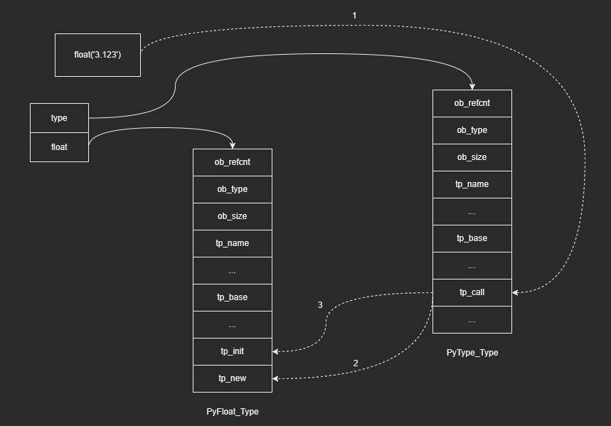
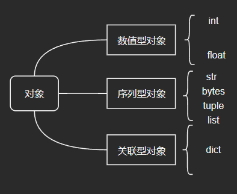

# Python对象的生命周期

注：本篇是根据教程学习记录的笔记，部分内容与教程是相同的，因为转载需要填链接，但是没有，所以填的原创，如果侵权会直接删除。

思考：

1. 当我们输入这个语句的时候，Python内部是如何去创建这个对象的？

   ```python
   a = 1.0
   ```

2. 对象使用完毕，销毁的时机又是怎么确定的呢？

下面，我们以一个基本类型float为例，来分析对象从创建到销毁这整个生命周期中的行为。

## 1 C API

Python是用C写的，对外提供了API，让用户可以从C环境中与其交互，并且Python内部也大量使用了这些API。C API分为两类：**泛型API**以及**特型API**。

- 泛型API：与类型无关，属于抽象对象层，这类API的参数是PyObject *，即可以处理任意类型的对象。以PyObject_Print为例：

  ```c
  // 打印浮点对象
  PyObject *fo = PyFloat_FromDouble(3.14);
  PyObject_Print(fo, stdout, 0);
  
  // 打印整数对象
  PyObject *lo = PyLong_FromLong(100);
  PyObject_Print(lo, stdout, 0);
  ```

- 特型API：与类型相关，属于具体对象层，这类API只能作用于某种类型的对象


## 2 对象的创建

### 2.1 两种创建对象的方式

Python内部一般通过两种方法创建对象：

- 通过C API，多用于内建类型

  - 以浮点类型为例，Python内部提供PyFloat_FromDouble，这是一个特型C API，在这个接口内部为PyFloatObject结构体变量分配内存，并初始化相关字段：

    ```c
    PyObject *
    PyFloat_FromDouble(double fval)
    {
        PyFloatObject *op = free_list;
        if (op != NULL) {
            free_list = (PyFloatObject *) Py_TYPE(op);
            numfree--;
        } else {
            op = (PyFloatObject*) PyObject_MALLOC(sizeof(PyFloatObject));
            if (!op)
                return PyErr_NoMemory();
        }
        /* Inline PyObject_New */
        (void)PyObject_INIT(op, &PyFloat_Type);
        op->ob_fval = fval;
        return (PyObject *) op;
    }
    ```

- 通过类型对象，多用于自定义类型

  - 对于自定义类型，Python就无法事先提供C API了，这种情况下就只能通过类型对象中包含的元数据（分配多少内存，如何初始化等等）来创建实例对象。

  - 由类型对象创建实例对象是一个更通用的流程，对于内建类型，除了通过C API来创建对象意外，同样也可以通过类型对象来创建。以浮点类型为例，我们通过类型对象float，创建了一个实例对象f：

    ```python
    f: float = float('3.123')
    ```

### 2.2 由类型对象创建实例对象

思考：既然我们可以通过类型对象来创建实例对象，那么类型对象中应该存在相应的接口。

- 在PyType_Type中找到了tp_call字段：

  ```python
  PyTypeObject PyType_Type = {
      PyVarObject_HEAD_INIT(&PyType_Type, 0)
      "type",                                     /* tp_name */
      sizeof(PyHeapTypeObject),                   /* tp_basicsize */
      sizeof(PyMemberDef),                        /* tp_itemsize */
      (destructor)type_dealloc,                   /* tp_dealloc */
      // ...
      
      (ternaryfunc)type_call,                     /* tp_call */
      
      // ...
  };
  ```

- 因此，float('3.123')在C层面就等价于：

  ```c
  PyFloat_Type.ob_type.tp_call(&PyFloat_Type, args. kwargs)
  ```

  这里大家可以思考下为什么是PyFloat_Type.ob_type——因为我们在float('3.14')中是通过float这个类型对象去创建一个浮点对象，而对象的通用方法是由它对应的类型管理的，自然float的类型就是type，所以我们要找的就是type的tp_call字段。

- type_call函数的C源码：（只列出部分）

  ```c
  static PyObject *
  type_call(PyTypeObject *type, PyObject *args, PyObject *kwds)
  {
      PyObject *obj;
  
      // ...
  
      obj = type->tp_new(type, args, kwds);
      obj = _Py_CheckFunctionResult((PyObject*)type, obj, NULL);
      if (obj == NULL)
          return NULL;
  
      // ...
  
      type = Py_TYPE(obj);
      if (type->tp_init != NULL) {
          int res = type->tp_init(obj, args, kwds);
          if (res < 0) {
              assert(PyErr_Occurred());
              Py_DECREF(obj);
              obj = NULL;
          }
          else {
              assert(!PyErr_Occurred());
          }
      }
      return obj;
  }
  ```

  其中有两个关键的步骤：（这两个步骤大家应该是很熟悉的）

  1. 调用类型对象的tp_new函数指针，用于**申请内存**；
  2. 如果类型对象的tp_init函数指针不为空，则会对对象进行**初始化**。

- 总结：（以float为例）

  1. 调用float，Python最终执行的是其类型对象type的tp_call指针指向的type_call函数。
  2. type_call函数调用float的tp_new函数为实例对象分配内存空间。
  3. type_call函数必要时进一步调用tp_init函数对实例对象进行初始化。

  图示如下：

  

## 3 对象的多态性

- 通过类型对象创建实例对象，最后会落实到调用type_call函数，其中保存具体对象时，使用的是PyObject *obj，并没有通过一个具体的对象（例如PyFloatObject）来保存。这样做的好处是：可以实现更抽象的上层逻辑，而不用关心对象的实际类型和实现细节。（记得当初从C语言的面向过程向Java中的面向对象过度的时候，应该就是从结构体）

- 以对象哈希值计算为例，有这样一个函数接口：

  ```c
  Py_hash_t
  PyObject_Hash(PyObject *v)
  {
      // ...
  }
  ```

  对于浮点数对象和整数对象：

  ```c
  PyObject *fo = PyFloatObject_FromDouble(3.14);
  PyObject_Hash(fo);
  
  PyObject *lo = PyLongObject_FromLong(100);
  PyObject_Hash(lo);
  ```

  可以看到，对于浮点数对象和整数对象，我们计算对象的哈希值时，调用的都是PyObject_Hash()这个函数，但是对象类型不同，其行为是有区别的，哈希值计算也是如此。那么在PyObject_Hash函数内部是如何区分的呢？

- PyObject_Hash()函数具体逻辑：

  ```c
  Py_hash_t
  PyObject_Hash(PyObject *v)
  {
      PyTypeObject *tp = Py_TYPE(v);
      if (tp->tp_hash != NULL)
          return (*tp->tp_hash)(v);
      /* To keep to the general practice that inheriting
       * solely from object in C code should work without
       * an explicit call to PyType_Ready, we implicitly call
       * PyType_Ready here and then check the tp_hash slot again
       */
      if (tp->tp_dict == NULL) {
          if (PyType_Ready(tp) < 0)
              return -1;
          if (tp->tp_hash != NULL)
              return (*tp->tp_hash)(v);
      }
      /* Otherwise, the object can't be hashed */
      return PyObject_HashNotImplemented(v);
  }
  ```

  函数会首先通过Py_TYPE找到对象的类型，然后通过类型对象的tp_hash函数指针来调用对应的哈希计算函数。即：PyObject_Hash()函数根据对象的类型，调用不同的函数版本，这就是**多态**。

## 4 对象的行为

- 除了tp_hash字段，PyTypeObject结构体还定义了很多函数指针，这些指针最终都会指向某个函数，或者为空。我们可以把这些函数指针看作是类型对象中定义的操作，这些操作决定了对应的实例对象在运行时的**行为**。

- 虽然不同的类型对象中保存了对应实例对象共有的行为，但是不同类型的对象也会存在一些共性。例如：整数对象和浮点数对象都支持加减乘除等擦欧总，元组对象和列表对象都支持下标操作。因此，我们以行为为分类标准，对对象进行分类：

  

- Python以此为依据，为每个类别都定义了一个标准操作集：

  - PyNumberMethods结构体定义了数值型操作
  - PySequenceMethods结构体定义了序列型操作
  - PyMappingMethods结构体定义了关联型操作

  如果类型对象提供了相关的操作集，则对应的实例对象就具备对应的行为：

  ```c
  typedef struct _typeobject {
      PyObject_VAR_HEAD
      const char *tp_name; /* For printing, in format "<module>.<name>" */
      Py_ssize_t tp_basicsize, tp_itemsize; /* For allocation */
  
     // ...
  
      PyNumberMethods *tp_as_number;
      PySequenceMethods *tp_as_sequence;
      PyMappingMethods *tp_as_mapping;
  
      // ...
  
  } PyTypeObject;
  ```

- 以float为例，类型对象PyFloat_Type的这三个字段是这样初始化的：

  ```c
  PyTypeObject PyFloat_Type = {
      PyVarObject_HEAD_INIT(&PyType_Type, 0)
      "float",
      sizeof(PyFloatObject),
      
      // ...
      
      &float_as_number,                           /* tp_as_number */
      0,                                          /* tp_as_sequence */
      0,                                          /* tp_as_mapping */
      
      // ...
  };
  ```

  可以看到，只有tp_as_number非空，即float对象支持数值型操作，不支持序列型操作和关联型操作。

## 5 引用计数

在Python中，很多场景都涉及引用计数的调整：

- 变量赋值
- 函数参数传递
- 属性操作
- 容器操作

引用计数是Python生命周期中很关键的一个知识点，后续我会用一个单独的章节来介绍，这里咱们先按下不表。
