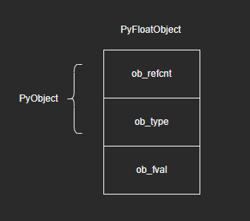
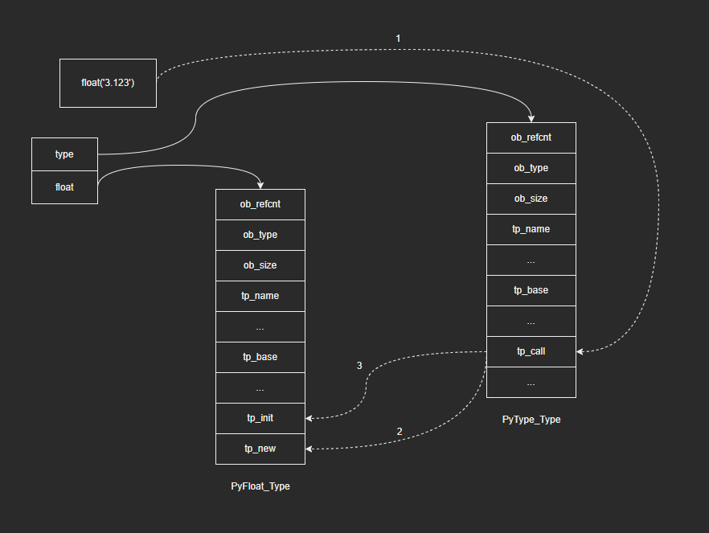
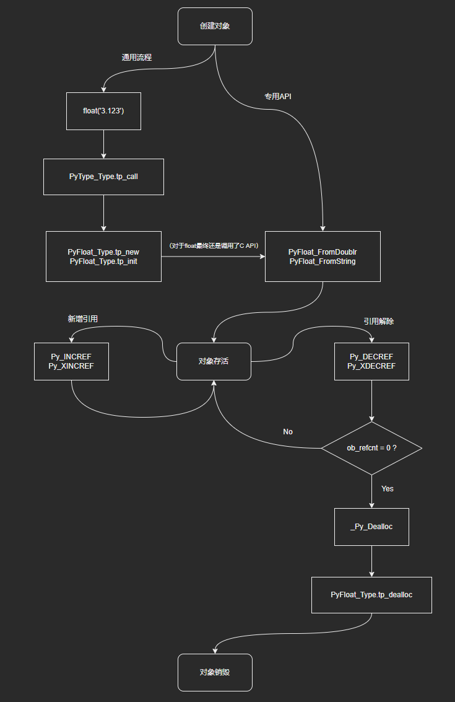
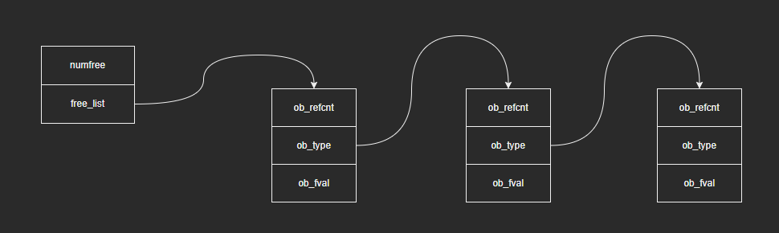
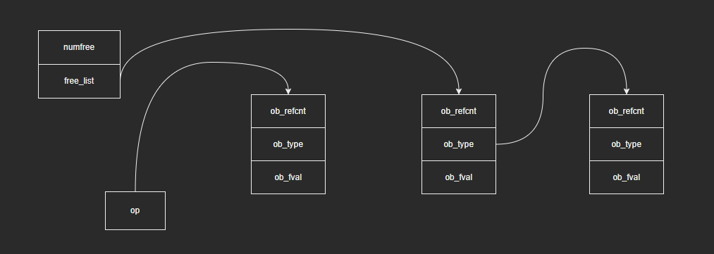

# 深入认识Python内建类型——float

注：本篇是根据教程学习记录的笔记，部分内容与教程是相同的，因为转载需要填链接，但是没有，所以填的原创，如果侵权会直接删除。

## 1 回顾float的基础知识

### 1.1 PyFloatObject



### 1.2 PyFloat_Type

- C源码（仅列出部分字段）：

  ```c
  PyTypeObject PyFloat_Type = {
      PyVarObject_HEAD_INIT(&PyType_Type, 0)
      "float",
      sizeof(PyFloatObject),
      0,
      (destructor)float_dealloc,                  /* tp_dealloc */
      0,                                          /* tp_print */
      0,                                          /* tp_getattr */
      0,                                          /* tp_setattr */
      0,                                          /* tp_reserved */
      (reprfunc)float_repr,                       /* tp_repr */
      &float_as_number,                           /* tp_as_number */
      0,                                          /* tp_as_sequence */
      0,                                          /* tp_as_mapping */
      (hashfunc)float_hash,                       /* tp_hash */
      0,                                          /* tp_call */
      (reprfunc)float_repr,                       /* tp_str */
      
      // ...
      
      0,                                          /* tp_init */
      0,                                          /* tp_alloc */
      float_new,                                  /* tp_new */
  };
  ```

- PyFloat_Type中保存了很多关于浮点对象的元信息，关键字段包括：

  - tp_name：保存类型名称，常量float
  - tp_dealloc、tp_init、tp_alloc和tp_new：对象创建和销毁的相关函数
  - tp_repr：生成语法字符串表示形式的函数
  - tp_str：生成普通字符串表示形式的函数
  - tp_as_number：数值操作集
  - tp_hash：哈希值生成函数

### 1.3 对象的创建

- 通过类型对象创建实例对象：

  

- 通过C API创建实例对象：

  ```c
  PyObject *
  PyFloat_FromDouble(double fval);
  
  PyObject *
  PyFloat_FromString(PyObject *v);

### 1.4 对象的销毁

- 当对象不再需要时，Python通过Py_DECREF或者Py_XDECREF宏来减少引用计数；当引用计数降为0时，Python通过_Py_Dealloc宏回收对象。（有关引用计数的内容后续会详细介绍）

- _Py_Dealloc宏实际上调用的是*Py_TYPE(op)->tp_dealloc，对于float即调用float_dealloc：

  ```c
  #define _Py_Dealloc(op) (                               \
      _Py_INC_TPFREES(op) _Py_COUNT_ALLOCS_COMMA          \
      (*Py_TYPE(op)->tp_dealloc)((PyObject *)(op)))
  ```

### 1.5 总结

最后将对象从创建到销毁整个生命周期所涉及的关键函数、宏以及调用关系整理如下：



## 2 空闲对象缓存池

问题：浮点运算背后涉及大量临时对象创建和销毁。

```python
area = pi * r ** 2
```

这个语句首先计算半径r的平方，中间结果由一个临时对象来保存，假设是t；然后计算pi与t的乘积，得到最终结果并赋值给变量area；最后，销毁临时对象t。创建对象时需要分配内存，销毁对象时又要回收内存，大量临时对象创建和销毁，意味着大量内存分配回收操作，这是不能接受的。因此，Python在浮点对象销毁之后，并不急于回收内存，而是将对象放入一个空闲链表，后续需要创建浮点对象时，先到空闲链表中取，省去了部分分配内存的开销。

### 2.1 浮点对象的空闲链表

- C源码：

  ```c
  #ifndef PyFloat_MAXFREELIST
  #define PyFloat_MAXFREELIST    100
  #endif
  static int numfree = 0;
  static PyFloatObject *free_list = NULL;
  ```

  源码解读：

  - free_list变量：指向空闲链表头节点的指针
  - numfree变量：维护空闲链表当前长度
  - PyFloat_MAXFREELIST宏：限制空闲链表的最大长度，避免占用过多内存

- 为了保持简洁，Python把ob_type字段当作next指针来用，将空闲对象串成链表。float空闲链表图示如下：

  

- 个人体会：

  - Python中这样的池技术很多地方都在用，并且在实际工程中，这也是一种广泛使用的方式，大家可以具体体会下。
  - “把ob_type字段当作next指针来用“，这种方式可以学习，但是也要结合实际情况：可读性，是否需要节省这部分内存等等。

### 2.2 空闲链表的使用

- 有了空闲链表之后，需要创建浮点对象时，可以从链表中取出空闲对象，省去申请内存的开销，以PyFloat_FromDouble()为例：（只列出部分代码）

  ```c
  PyObject *
  PyFloat_FromDouble(double fval)
  {
      PyFloatObject *op = free_list;
      if (op != NULL) {
          free_list = (PyFloatObject *) Py_TYPE(op);
          numfree--;
      } else {
          op = (PyFloatObject*) PyObject_MALLOC(sizeof(PyFloatObject));
          if (!op)
              return PyErr_NoMemory();
      }
      /* Inline PyObject_New */
      (void)PyObject_INIT(op, &PyFloat_Type);
      op->ob_fval = fval;
      return (PyObject *) op;
  }
  ```

  1. 检查free_list是否为空
  2. 如果free_list非空，取出头节点备用，free_list指向第二个节点（这里看代码调用的是Py_TYPE()，也就是op的ob_type字段，也就是第二个节点），并将numfree减1
  3. 如果free_list为空，则调用PyObject_MALLOC分配内存
  4. 最后会通过PyObject_INIT对op进行相应设置（包括修改ob_type），然后设置ob_fval为fval

  图示如下：（对比2.1中的图示，可以看到free_list指向了第二个节点，并且第一个节点的ob_type字段也不再指向第二个节点，而是指向对应的类型对象）

  

- 对象销毁时，Python将其缓存在空闲链表中，以备后用。float_dealloc函数源码如下：

  ```c
  static void
  float_dealloc(PyFloatObject *op)
  {
      if (PyFloat_CheckExact(op)) {
          if (numfree >= PyFloat_MAXFREELIST)  {
              PyObject_FREE(op);
              return;
          }
          numfree++;
          Py_TYPE(op) = (struct _typeobject *)free_list;
          free_list = op;
      }
      else
          Py_TYPE(op)->tp_free((PyObject *)op);
  }
  ```

  1. 若空闲链表长度达到限制值，调用PyObject_FREE回收对象内存
  2. 若空闲链表长度未达到限制值，则将对象插到空闲链表头部（这里可以顺带复习下头插法，hh）

## 3 其他

问题：以下例子中，变量e的id值为何与已销毁的变量pi相同？

```python
>>> pi = 3.14
>>> id(pi)
4565221808
>>> del pi
>>> e = 2.71
>>> id(e)
4565221808
```

答：在3.14这个浮点数对象被销毁时，并没有直接回收其内存，而是将对象缓存在空闲链表中，此时3.14这个浮点数对象为空闲链表头节点；当创建浮点对象2.71时，此时空闲链表非空，则取出空闲链表的头节点，修改ob_fval值为2.71，因此两个对象的id是一样的。
