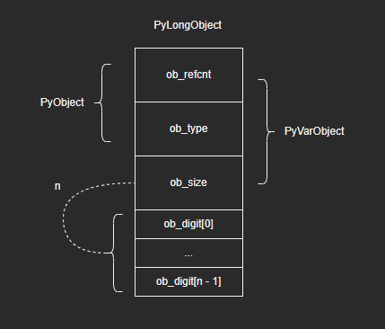
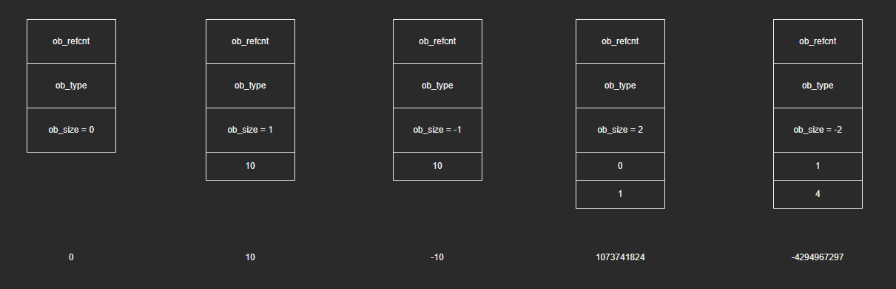
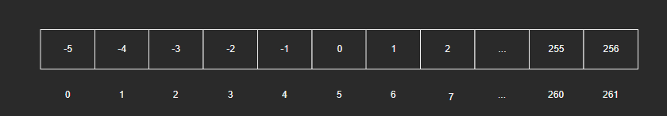
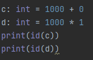
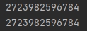
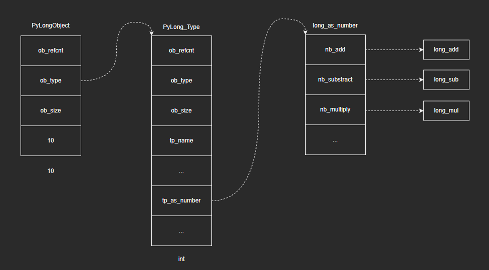

# 深入认识Python内建类型——int

注：本篇是根据教程学习记录的笔记，部分内容与教程是相同的，因为转载需要填链接，但是没有，所以填的原创，如果侵权会直接删除。

问题：对于C语言，下面这个程序运行后的结果是什么？是1000000000000吗？

```c
#include <stdio.h>
int main(int argc, char *argv[])
{
    int value = 1000000;
    print("%d\n", value * value)
}
```

输出如下：

```c
-727379968
```

在计算机系统中，如果某种类型的变量的存储空间固定，它能表示的数值范围就是有限的。以int为例，在C语言中，该类型变量长度为32位，能表示的整数范围为-2147483648~2147483647。1000000000000显然是超出范围的，即发生了整数溢出。但是对于Python中的int，则不会出现这种情况：

```python
>>> 1000000 * 1000000
1000000000000

>>> 10 ** 100
10000000000000000000000000000000000000000000000000000000000000000000000000000000000000000000000000000
```

## 1 int对象的设计

### 1.1 PyLongObject

- int对象的结构体：

  ```c
  typedef struct _longobject PyLongObject;
  
  struct _longobject {
      PyObject_VAR_HEAD
      digit ob_digit[1];
  };
  ```

- digit数组

  ```c
  #if PYLONG_BITS_IN_DIGIT == 30
  typedef uint32_t digit;
  // ...
  #elif PYLONG_BITS_IN_DIGIT == 15
  typedef unsigned short digit;
  // ...
  #endif
  ```

  digit数组具体用什么整数类型来实现，Python提供了两个版本，一个是32位的unit32_t，一个是16位的unsigned short，可以通过宏定义指定选用的版本。至于为什么这么设计，这主要是出于内存方面的考量，对于范围不大的整数，用16位整数表示即可，用32位会比较浪费。

  （注：可以看到PYLONG_BITS_IN_DIGIT宏的值为30或15，也就是说Python只使用了30位或15位，这是为什么呢——这是Python出于对加法进位的考量。如果全部32位都用来保存绝对值，那么为了保证加法不溢出（产生进位），需要先强制转化成64位类型后再进行计算。但牺牲最高1位后，加法运算便不用担心进位溢出了。那么，为什么对32位时是牺牲最高2位呢？可能是为了和16位整数方案统一起来：如果选用16位整数，Python只使用15位；32位就使用30位。）

  实际上，由于PyObject_VAR_HEAD头部的存在，32位和16位的选择其实差别不大：

  | 整数对象    | 基本单位16位    | 基本单位32位    |
  | ----------- | --------------- | --------------- |
  | 1           | 24 + 2 * 1 = 26 | 24 + 4 * 1 = 28 |
  | 1000000     | 24 + 2 * 2 = 28 | 24 + 4 * 1 = 28 |
  | 10000000000 | 24 + 2 * 3 = 30 | 24 + 4 * 2 = 32 |

- int对象结构图示如下：

  
  
  对于比较大的整数，Python将其拆成若干部分，保存在ob_digit数组中。然而我们注意到在结构体定义中，ob_digit数组长度却固定为1，这是为什么呢？这里资料解释是：**”由于C语言中数组长度不是类型信息，我们可以根据实际需要为ob_digit数组分配足够的内存，并将其当成长度为n的数组操作。这也是C语言中一个常用的编程技巧。”**但是根据我对C语言的理解，数组是由基址+偏移来确定位置的，初始长度为1的数组，后续如果强行去索引超过这个长度的位置，不是会出问题吗？不知道是我理解错了还是什么，这里后续还要进一步考证。

### 1.2 整数的布局

- 整数分为正数、负数和零，这三种不同整数的存储方式如下：

  - 将整数的绝对值保存在ob_digit数组中
  - ob_digit数组长度保存在ob_size字段，若整数为负，则ob_size为负数
  - 整数零的ob_size为0，ob_digit数组为空

- 下面以五个典型的例子来介绍不同情况下的整数存储情况：

  

  1. 对于整数0，ob_size = 0，ob_digit为空，无需分配

  2. 对于整数10，其绝对值保存在ob_digit数组中，数组长度为1，ob_size字段为1

  3. 对于整数-10，其绝对值保存在ob_digit数组中，数组长度为1，ob_size字段为-1

  4. 对于整数1073741824（即2^30），由于Python只使用了32位的后30位，所以2^30次方需要两个数组元素来存储，整数数组的长度为2。绝对值这样计算：

     2^0 * 0 + 2^30 * 1 = 1073741824

  5. 对于整数-4294967297（即-(2^32 + 1)），同样需要长度为2的数组，但ob_size字段为负数。绝对值这样计算：

     2^0 * 1 + 2^30 * 4 = 4294967297

  **总结**：ob_digit数组存储数据时，类似2^30进制计算（或2^15进制，取决于数组的类型）

### 1.3 小整数静态对象池

问题：通过前面章节的学习，我们知道整数对象是不可变对象，整数运算结果都是以新对象返回的：

```python
>>> a = 1
>>> id(a)
1497146464
>>> a += 1
>>> id(a)
1496146496
```

Python这样的设计会带来一个性能缺陷，程序运行时必定会有大量对象的创建销毁，即会带来大量的内存分配和回收消耗，严重影响性能。例如对于一个循环100次的for循环，就需要创建100个int对象，这显然是不能接受的。对此，Python的解决方法是：预先将常用的整数对象创建好，以后备用，这就是**小整数对象池**。（和float一样运用池技术，但是稍有不同，这也是由int和float实际运用的差别导致的）

- 小整数对象池相关源码：

  ```c
  #ifndef NSMALLPOSINTS
  #define NSMALLPOSINTS           257
  #endif
  #ifndef NSMALLNEGINTS
  #define NSMALLNEGINTS           5
  #endif
  
  static PyLongObject small_ints[NSMALLNEGINTS + NSMALLPOSINTS];
  ```

  - NSMALLPOSINTS宏规定了对象池正数个数（包括0），默认257个
  - NSMALLNEGINTS宏规定了对象池负数个数，默认为5个
  - small_ints是一个整数对象数组，保存预先创建好的小整数对象

- 以默认配置为例，Python启动后静态创建一个包含262个元素的整数数组，并依次初始化-5到-1，0，和1到256这些整数对象。小整数对象池结构如下：

  

### 1.4 示例

- 示例1：

  ```python
  >>> a = 1 + 0
  >>> b = 1 * 1
  >>> id(a), id(b)
  (1541936120048, 1541936120048)
  ```

  由于1 + 0的计算结果为1，在小整数范围内，Python会直接从静态对象池中取出整数1；1 * 1也是同理。名字a和b其实都跟一个对象绑定（有关名字绑定的内容可以看这篇文章：“12-作用域与名字空间”），即小整数对象池中的整数1，因此它们的id相同。

- 示例2：

  ```python
  >>> c = 1000 + 0
  >>> d = 1000 * 1
  >>> id(c), id(d)
  (3085872130224, 3085872130256)
  ```

  1000 + 0 和1000 * 1的计算结果都是1000，但由于1000不在小整数池范围内，Python会分别创建对象并返回，因此c和d绑定的对象id也就不同了。
  
  注：这里大家如果使用Pycharm来运行的话就会发现它们的id是一样的：
  
  
  
  
  
  这里的原因本质上是和字节码相关的，在IDLE中，每个命令都会单独去编译，而在Pycharm中是编译整个py文件，在同一上下文（这里“同一上下文”其实比较模糊，笔者水平有限，解释得也不太好）中的相同值的整数就是同一个对象，可以试着把字节码打印出来看一下（有关字节码的内容可以看下这篇博客：“11-Python程序执行过程与字节码”）。
  
  

## 2 大整数运算

问题：在之前我们了解到了整数对象的内部结构，对于Python如何应对“整数溢出”这个问题有了一个初步的认识。但是真正的难点在于大整数数学运算的实现。

### 2.1 整数运算概述

- 整数对象的运算由整数类型对象中的tp_as_number、tp_as_sequence、tp_as_mapping这三个字段所决定。整数类型对象PyLong_Type源码如下：（只列出部分字段）

  ```c
  PyTypeObject PyLong_Type = {
      PyVarObject_HEAD_INIT(&PyType_Type, 0)
      "int",                                      /* tp_name */
      offsetof(PyLongObject, ob_digit),           /* tp_basicsize */
      sizeof(digit),                              /* tp_itemsize */
      
      // ...
      
      &long_as_number,                            /* tp_as_number */
      0,                                          /* tp_as_sequence */
      0,                                          /* tp_as_mapping */
      
      // ...
  };
  ```

- 整数对象仅支持数值型操作long_as_number：

  ```c
  static PyNumberMethods long_as_number = {
      (binaryfunc)long_add,       /*nb_add*/
      (binaryfunc)long_sub,       /*nb_subtract*/
      (binaryfunc)long_mul,       /*nb_multiply*/
      long_mod,                   /*nb_remainder*/
      long_divmod,                /*nb_divmod*/
      long_pow,                   /*nb_power*/
      (unaryfunc)long_neg,        /*nb_negative*/
      (unaryfunc)long_long,       /*tp_positive*/
      (unaryfunc)long_abs,        /*tp_absolute*/
      (inquiry)long_bool,         /*tp_bool*/
      (unaryfunc)long_invert,     /*nb_invert*/
      long_lshift,                /*nb_lshift*/
      (binaryfunc)long_rshift,    /*nb_rshift*/
      long_and,                   /*nb_and*/
      long_xor,                   /*nb_xor*/
      long_or,                    /*nb_or*/
      long_long,                  /*nb_int*/
      0,                          /*nb_reserved*/
      long_float,                 /*nb_float*/
      0,                          /* nb_inplace_add */
      0,                          /* nb_inplace_subtract */
      0,                          /* nb_inplace_multiply */
      0,                          /* nb_inplace_remainder */
      0,                          /* nb_inplace_power */
      0,                          /* nb_inplace_lshift */
      0,                          /* nb_inplace_rshift */
      0,                          /* nb_inplace_and */
      0,                          /* nb_inplace_xor */
      0,                          /* nb_inplace_or */
      long_div,                   /* nb_floor_divide */
      long_true_divide,           /* nb_true_divide */
      0,                          /* nb_inplace_floor_divide */
      0,                          /* nb_inplace_true_divide */
      long_long,                  /* nb_index */
  };
  ```

- 至此，我们明确了整数对象支持的全部数学运算，以及对应的处理函数：（只列出部分函数）

  | 数学运算 | 处理函数    | 示例   |
  | -------- | ----------- | ------ |
  | 加法     | long_add    | a + b  |
  | 减法     | long_sub    | a - b  |
  | 乘法     | long_mul    | a * b  |
  | 取模     | long_mod    | a % b  |
  | 除法     | long_divmod | a / b  |
  | 指数     | long_pow    | a ** b |

- 整数对象、整数类型对象以及整数数学运算处理函数之间的关系：

  

### 2.2 大整数运算处理过程

以加法为例，来认识大整数运算的处理过程。

1. 加法处理函数long_add()

   - long_add()源码：

     ```c
     static PyObject *
     long_add(PyLongObject *a, PyLongObject *b)
     {
         PyLongObject *z;
     
         CHECK_BINOP(a, b);
     
         if (Py_ABS(Py_SIZE(a)) <= 1 && Py_ABS(Py_SIZE(b)) <= 1) {
             return PyLong_FromLong(MEDIUM_VALUE(a) + MEDIUM_VALUE(b));
         }
         if (Py_SIZE(a) < 0) {
             if (Py_SIZE(b) < 0) {
                 z = x_add(a, b);
                 if (z != NULL) {
                     /* x_add received at least one multiple-digit int,
                        and thus z must be a multiple-digit int.
                        That also means z is not an element of
                        small_ints, so negating it in-place is safe. */
                     assert(Py_REFCNT(z) == 1);
                     Py_SIZE(z) = -(Py_SIZE(z));
                 }
             }
             else
                 z = x_sub(b, a);
         }
         else {
             if (Py_SIZE(b) < 0)
                 z = x_sub(a, b);
             else
                 z = x_add(a, b);
         }
         return (PyObject *)z;
     }
     ```

     主体逻辑如下：

     - 第4行：定义变量z用于临时保存计算结果
     - 第8~10行：如果两个对象数组长度均不超过1，用MEDIUM_VALUE宏将其转化成C整数进行运算（这种优化也是可以学习的）
     - 第13~17行：如果两个整数均为负数，调用x_add计算两者绝对值之和，再将结果符号设置为负（16行处）
     - 第20行：如果a为负数，b为正数，调用x_sub计算b和a的绝对值之差即为最终结果
     - 第24行：如果a为正数，b为负数，调用x_sub计算a和b的绝对值之差即为最终结果
     - 第26行：如果两个整数均为正数，调用x_add计算两个绝对值之和即为最终结果

   - 因此，long_add函数实际上将整数加法转化成了绝对值加法x_add和绝对值减法x_sub，以及MEDIUM_VALUE。绝对值加法和绝对值减法不用考虑符号对计算结果的影响，实现较为简单，这是Python将整数运算转化成绝对值运算的原因。（这里也可以学习下）

   - 大整数运算涉及到两个数组之间的加法，整数数值越大，整数对象底层数组就越长，运算开销也会越大。但是运算处理函数提供了一个快速通道：如果参与运算的整数对象底层数组长度均不超过1，直接将整数对象转化成C整数类型进行运算，性能耗损极小。满足这个条件的整数范围在-1073741823~1073747823之间，足以覆盖大部分运算情况了。

2. 绝对值加法x_add()

   - 下面我们来看一下Python是如何对数组进行加法运算的。x_add()源码：

     ```c
     /* Add the absolute values of two integers. */
     
     static PyLongObject *
     x_add(PyLongObject *a, PyLongObject *b)
     {
         Py_ssize_t size_a = Py_ABS(Py_SIZE(a)), size_b = Py_ABS(Py_SIZE(b));
         PyLongObject *z;
         Py_ssize_t i;
         digit carry = 0;
     
         /* Ensure a is the larger of the two: */
         if (size_a < size_b) {
             { PyLongObject *temp = a; a = b; b = temp; }
             { Py_ssize_t size_temp = size_a;
                 size_a = size_b;
                 size_b = size_temp; }
         }
         z = _PyLong_New(size_a+1);
         if (z == NULL)
             return NULL;
         for (i = 0; i < size_b; ++i) {
             carry += a->ob_digit[i] + b->ob_digit[i];
             z->ob_digit[i] = carry & PyLong_MASK;
             carry >>= PyLong_SHIFT;
         }
         for (; i < size_a; ++i) {
             carry += a->ob_digit[i];
             z->ob_digit[i] = carry & PyLong_MASK;
             carry >>= PyLong_SHIFT;
         }
         z->ob_digit[i] = carry;
         return long_normalize(z);
     }
     ```

   - 源码分析：

     - 第10~15行：如果a数组长度比较小，将a、b交换，数组长度较大的那个在前面（感觉做算法题有时候就需要交换下，方便统一处理）
     - 第16~18行：创建新整数对象，用于保存计算结果（注意到长度必须要比a大，因为可能要进位）
     - 第19~23行：遍历b底层数组，与a对应部分相机啊并保存在z中，需要注意到进位（可以看到这里是用按位与和右移进行计算的，通过位于算来处理也是很高效的，算法题中也比较常见）
     - 第24~28行：遍历a底层数组的剩余部分，与进位相加后保存在z中，同样要注意进位运算
     - 第29行：将进位写入z底层数组最高位单元中
     - 第30行：标准化z，去除计算结果z底层数组中前面多余的0

## 3 其他

### 大整数转float溢出

至此，我们对int和float有了一定的认识，也自然会有一个问题：将大整数int转化为float时发生溢出怎么办？

示例：

```python
>>>i = 111111111111111111111111111111111111111111111111111111111111111111111111111111111111111111111111111111111111111111111111111111111111111111111111111111111111111111111111111111111111111111111111111111111111111111111111111111111111111111111111111111111111111111111111111111111111111111111111111111111111111111111111111111111111111111
>>> f = float(i)
Traceback (most recent call last):
  File "<pyshell#1>", line 1, in <module>
    f = float(i)
OverflowError: int too large to convert to float
```

由于float是有长度限制的，它的大小也是有上限的，因此当我们将一个很大的int转化为float时，如果超出上限就会报错。对此我们可以使用Decimal来解决：（这里只介绍了使用方式，具体原理大家可以去了解一下）

```python
>>> from decimal import Decimal
>>>d = Decimal(i)
>>>f2 = float(d)
>>> f2
inf
```

可以看到将i通过Decimal()转化后就不会报错了。
