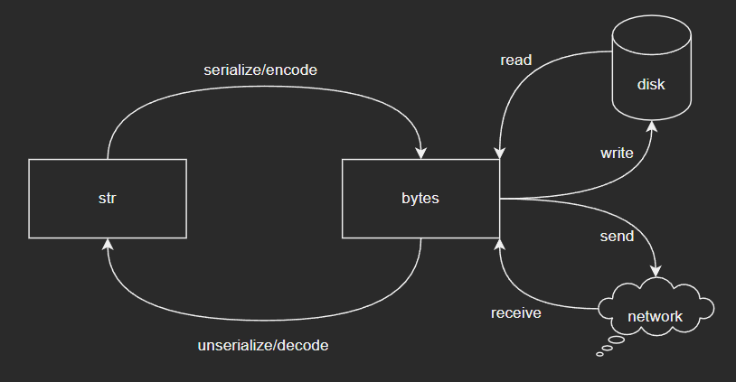
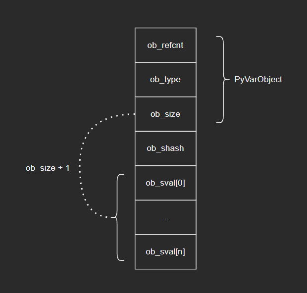
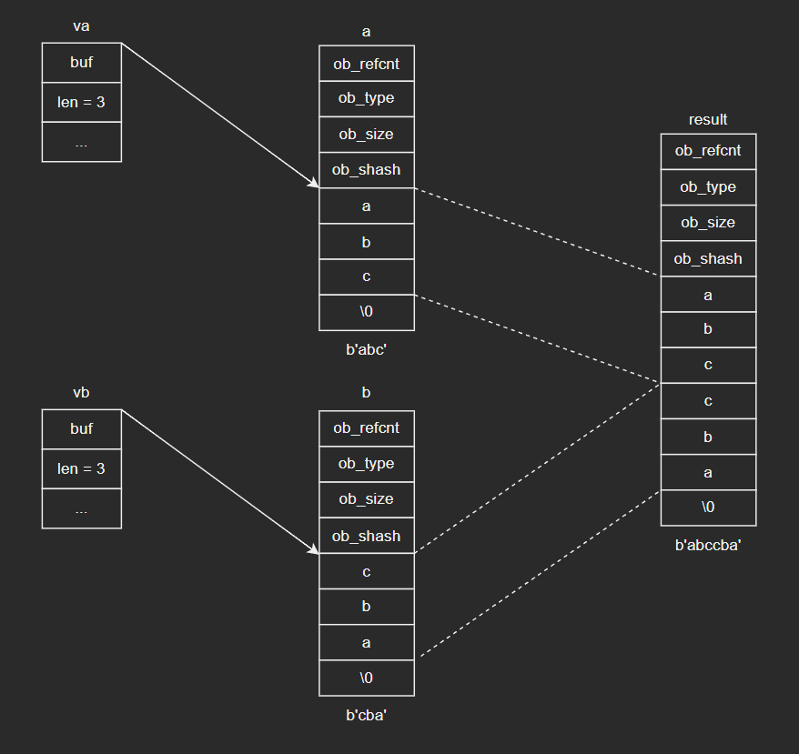
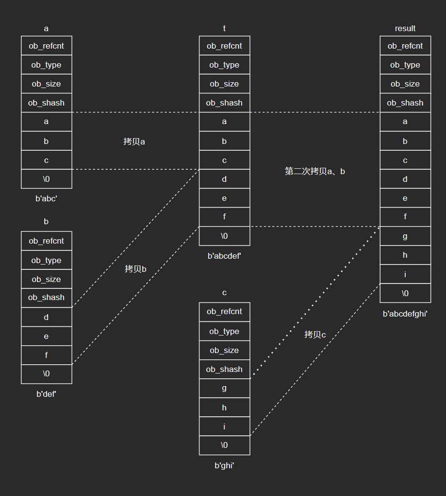
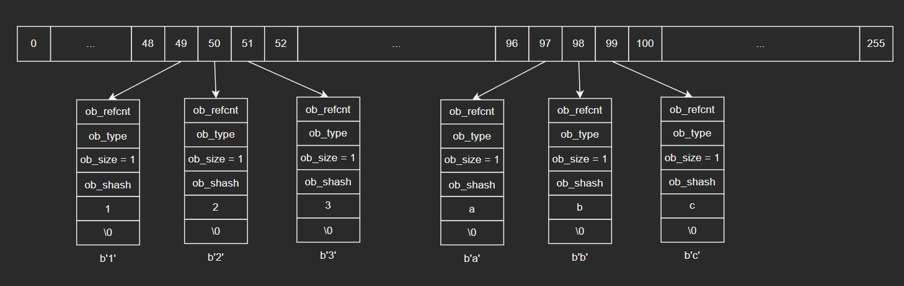
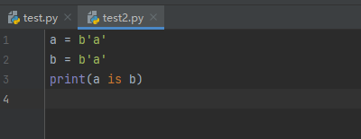
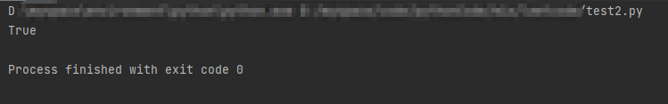
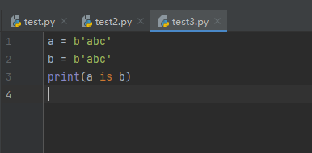
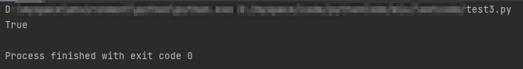

# 深入认识Python内建类型——bytes

注：本篇是根据教程学习记录的笔记，部分内容与教程是相同的，因为转载需要填链接，但是没有，所以填的原创，如果侵权会直接删除。

在我们日常的开发中，str是很常用的一个内建类型，与之相关的我们比较少接触的就是bytes，这里先为大家介绍一下bytes相关的知识点，下一篇博客再详细介绍str的相关内容。

## 1 bytes和str之间的关系

- 不少语言中的字符串都是由**字符数组**（或称为**字节序列**）来表示的，例如C语言：

  ```c
  char str[] = "Hello World!";
  ```

- 由于一个字节最多只能表示256种字符，要想覆盖众多的字符（例如汉字），就需要通过多个字节来表示一个字符，即**多字节编码**。但由于原始字节序列中没有维护编码信息，操作不慎就很容易导致各种乱码现象。

- Python提供的解决方法是使用Unicode对象（也就是str对象），Unicode口语表示各种字符，无需关心编码。但是在存储或者网络通讯时，字符串对象需要**序列化**成字节序列。为此，Python额外提供了字节序列对象——bytes。

- str和bytes的关系如图所示：

  

  str对象统一表示一个字符串，不需要关心编码；计算机通过字节序列与存储介质和网络介质打交道，字节序列用bytes对象表示；存储或传输str对象时，需要将其**序列化**成字节序列，序列化过程也是**编码**的过程。

## 2 bytes对象的结构：PyBytesObject

- C源码：

  ```c
  typedef struct {
      PyObject_VAR_HEAD
      Py_hash_t ob_shash;
      char ob_sval[1];
  
      /* Invariants:
       *     ob_sval contains space for 'ob_size+1' elements.
       *     ob_sval[ob_size] == 0.
       *     ob_shash is the hash of the string or -1 if not computed yet.
       */
  } PyBytesObject;
  ```

- 源码分析：

  - 字符数组ob_sval存储对应的字符，但是ob_sval数组的长度并不是ob_size，而是ob_size + 1.这是Python为待存储的字节序列额外分配了一个字节，用于在末尾处保存'\0'，以便兼容C字符串。
  - ob_shash：用于保存字节序列的哈希值。由于计算bytes对象的哈希值需要遍历其内部的字符数组，开销相对较大。因此Python选择将哈希值保存起来，以空间换时间（随处可见的思想，hh），避免重复计算。

- 图示如下：

  

## 3 bytes对象的行为

### 3.1 PyBytes_Type

- C源码：

  ```c
  PyTypeObject PyBytes_Type = {
      PyVarObject_HEAD_INIT(&PyType_Type, 0)
      "bytes",
      PyBytesObject_SIZE,
      sizeof(char),
      
      // ...
      
      &bytes_as_number,                           /* tp_as_number */
      &bytes_as_sequence,                         /* tp_as_sequence */
      &bytes_as_mapping,                          /* tp_as_mapping */
      (hashfunc)bytes_hash,                       /* tp_hash */
      
      // ...
  };
  ```

- 数值型操作bytes_as_number：

  ```c
  static PyNumberMethods bytes_as_number = {
      0,              /*nb_add*/
      0,              /*nb_subtract*/
      0,              /*nb_multiply*/
      bytes_mod,      /*nb_remainder*/
  };
  ```

  bytes_mod：

  ```c
  static PyObject *
  bytes_mod(PyObject *self, PyObject *arg)
  {
      if (!PyBytes_Check(self)) {
          Py_RETURN_NOTIMPLEMENTED;
      }
      return _PyBytes_FormatEx(PyBytes_AS_STRING(self), PyBytes_GET_SIZE(self),
                               arg, 0);
  }
  ```

  可以看到，bytes对象只是借用%运算符实现字符串格式化，并不是真正意义上的数值运算（这里其实和最开始的分类标准是有点歧义的，按标准应该再分一个“格式型操作”，不过灵活处理也是必须的）：

  ```python
  >>> b'msg: a = %d, b = %d' % (1, 2)
  b'msg: a = 1, b = 2'
  ```

- 序列型操作bytes_as_sequence：

  ```c
  static PySequenceMethods bytes_as_sequence = {
      (lenfunc)bytes_length, /*sq_length*/
      (binaryfunc)bytes_concat, /*sq_concat*/
      (ssizeargfunc)bytes_repeat, /*sq_repeat*/
      (ssizeargfunc)bytes_item, /*sq_item*/
      0,                  /*sq_slice*/
      0,                  /*sq_ass_item*/
      0,                  /*sq_ass_slice*/
      (objobjproc)bytes_contains /*sq_contains*/
  };
  ```

  bytes支持的序列型操作包括以下5个：

  - bytes_length：查询序列长度
  - bytes_concat：将两个序列合并为一个
  - bytes_repeat：将序列重复多次
  - bytes_item：取出给定下标的序列元素
  - bytes_contains：包含关系判断

- 关联型操作bytes_as_mapping：

  ```c
  static PyMappingMethods bytes_as_mapping = {
      (lenfunc)bytes_length,
      (binaryfunc)bytes_subscript,
      0,
  };
  ```

  可以看到bytes支持获取长度和切片两个操作。

### 3.2 bytes_as_sequence

这里我们主要介绍以下bytes_as_sequence相关的操作

- bytes_as_sequence中的操作都不复杂，但是会有一个“陷阱”，这里我们以bytes_concat操作来认识一下这个问题。C源码如下：

  ```c
  /* This is also used by PyBytes_Concat() */
  static PyObject *
  bytes_concat(PyObject *a, PyObject *b)
  {
      Py_buffer va, vb;
      PyObject *result = NULL;
  
      va.len = -1;
      vb.len = -1;
      if (PyObject_GetBuffer(a, &va, PyBUF_SIMPLE) != 0 ||
          PyObject_GetBuffer(b, &vb, PyBUF_SIMPLE) != 0) {
          PyErr_Format(PyExc_TypeError, "can't concat %.100s to %.100s",
                       Py_TYPE(b)->tp_name, Py_TYPE(a)->tp_name);
          goto done;
      }
  
      /* Optimize end cases */
      if (va.len == 0 && PyBytes_CheckExact(b)) {
          result = b;
          Py_INCREF(result);
          goto done;
      }
      if (vb.len == 0 && PyBytes_CheckExact(a)) {
          result = a;
          Py_INCREF(result);
          goto done;
      }
  
      if (va.len > PY_SSIZE_T_MAX - vb.len) {
          PyErr_NoMemory();
          goto done;
      }
  
      result = PyBytes_FromStringAndSize(NULL, va.len + vb.len);
      if (result != NULL) {
          memcpy(PyBytes_AS_STRING(result), va.buf, va.len);
          memcpy(PyBytes_AS_STRING(result) + va.len, vb.buf, vb.len);
      }
  
    done:
      if (va.len != -1)
          PyBuffer_Release(&va);
      if (vb.len != -1)
          PyBuffer_Release(&vb);
      return result;
  }
  ```

- bytes_concat源码大家可自行分析，这里直接以图示形式来展示，主要是为了说明其中的“陷阱”。图示如下：

  

  - Py_buffer提供了一套操作对象缓冲区的统一接口，屏蔽不同类型对象的内部差异
  - bytes_concat则将两个对象的缓冲区拷贝到一起，形成新的bytes对象

- 上述的拷贝过程是比较清晰的，但是这里隐藏着一个问题——数据拷贝的陷阱。

  以合并3个bytes对象为例：

  ```python
  >>> a = b'abc'
  >>> b = b'def'
  >>> c = b'ghi'
  >>> result = a + b + c
  >>> result
  b'abcdefghi'
  ```

  本质上这个过程会合并两次

  ```python
  >>> t = a + b
  >>> result = t + c
  ```

  在这个过程中，a和b的数据都会被拷贝两遍，图示如下：

  

  不难推出，合并n个bytes对象，头两个对象需要拷贝n - 1次，只有最后一个对象不需要重复拷贝，平均下来每个对象大约要拷贝n/2次。因此，下面的代码：

  ```python
  >>> result = b''
  >>> for b in segments:
      	result += s
  ```

  效率是很低的。我们可以使用join()来优化：

  ```python
  >>> result = b''.join(segments)
  ```

  join()方法是bytes对象提供的一个内建方法，可以高效合并多个bytes对象。join方法对数据拷贝进行了优化：先遍历待合并对象，计算总长度；然后根据总长度创建目标对象；最后再遍历待合并对象，逐一拷贝数据。这样一来，每个对象只需要拷贝一次，解决了重复拷贝的陷阱。（具体源码大家可以自行去查看）

## 4 字符缓冲池

- 和小整数一样，字符对象（即单字节的bytes对象）数量也很少，只有256个，但使用频率非常高，因此以空间换时间能明显提升执行效率。字符缓冲池源码如下：

  ```c
  static PyBytesObject *characters[UCHAR_MAX + 1];
  ```

- 下面我们从创建bytes对象的过程来看一下字符缓冲池的使用：PyBytes_FromStringAndSize()函数是负责创建bytes对象的通用接口，源码如下：

  ```c
  PyObject *
  PyBytes_FromStringAndSize(const char *str, Py_ssize_t size)
  {
      PyBytesObject *op;
      if (size < 0) {
          PyErr_SetString(PyExc_SystemError,
              "Negative size passed to PyBytes_FromStringAndSize");
          return NULL;
      }
      if (size == 1 && str != NULL &&
          (op = characters[*str & UCHAR_MAX]) != NULL)
      {
  #ifdef COUNT_ALLOCS
          one_strings++;
  #endif
          Py_INCREF(op);
          return (PyObject *)op;
      }
  
      op = (PyBytesObject *)_PyBytes_FromSize(size, 0);
      if (op == NULL)
          return NULL;
      if (str == NULL)
          return (PyObject *) op;
  
      memcpy(op->ob_sval, str, size);
      /* share short strings */
      if (size == 1) {
          characters[*str & UCHAR_MAX] = op;
          Py_INCREF(op);
      }
      return (PyObject *) op;
  }
  ```

  其中涉及字符缓冲区维护的关键步骤如下：

  - 第10~17行：如果创建的对象为单字节对象，会先在characters数组的对应序号判断是否已经有相应的对象存储在了缓冲区中，如果有则直接取出
  - 第28~31行：如果创建的对象为单字节对象，并且之前已经判断了不在缓冲区中，则将其放入字符缓冲池的对应位置

- 由此可见，当Python程序开始运行时，字符缓冲池是空的。随着单字节bytes对象的创建，缓冲池中的对象就慢慢多了起来。当缓冲池已缓存b'1'、b'2'、b'3'、b'a'、b'b'、b'c'这几个字符时，内部结构如下：

  

- 示例：

  注：这里大家可能在IDLE和PyCharm中获得的结果不一致，这个问题在之前的博客中也提到过，查阅资料后得到的结论是：IDLE运行和PyCharm运行的方式不同。这里我将PyCharm代码对应的代码对象反编译的结果展示给大家，但我对IDLE的认识还比较薄弱，以后有机会再给大家详细补充这个知识（抱拳~）。这里大家还是先以认识字符缓冲区这个概念为主，当然字节码的相关知识掌握好了也是很有帮助的。以下是PyCharm运行的结果：（以下操作的相关讲解可以看这篇博客：）

  - 示例1：

    

    

    下面我们来看一下反编译的结果：（下面的文件路径我省略了，大家自己试验的时候要输入正确的路径）

    ```python
    >>> text = open('D:\\...\\test2.py').read()
    >>> result= compile(text,'D:\\...\\test2.py', 'exec')
    >>> import dis
    >>> dis.dis(result)
      1           0 LOAD_CONST               0 (b'a')
                  2 STORE_NAME               0 (a)
    
      2           4 LOAD_CONST               0 (b'a')
                  6 STORE_NAME               1 (b)
    
      3           8 LOAD_NAME                2 (print)
                 10 LOAD_NAME                0 (a)
                 12 LOAD_NAME                1 (b)
                 14 IS_OP                    0
                 16 CALL_FUNCTION            1
                 18 POP_TOP
                 20 LOAD_CONST               1 (None)
                 22 RETURN_VALUE
    ```

    可以很清晰地看到，第5行和第8行的LOAD_CONST指令操作的都是下标为0的常量b'a'，因此此时a和b对应的是同一个对象，我们打印看一下：

    ```python
    >>> result.co_consts[0]
    b'a'
    ```

  - 示例2：

    为了确认只会缓存单字节的bytes对象，我在这里又尝试了多字节的bytes对象，同样还是在PyCharm环境下尝试：

    

    

    结果是比较出乎意料的：多字节的bytes对象依然是同一个。为了验证这个想法，我们先来看一下对代码对象的反编译结果：

    ```python
    >>> text = open('D:\\...\\test3.py').read()
    >>> result= compile(text,'D:\\...\\test3.py', 'exec')
    >>> import dis
    >>> dis.dis(result)
      1           0 LOAD_CONST               0 (b'abc')
                  2 STORE_NAME               0 (a)
    
      2           4 LOAD_CONST               0 (b'abc')
                  6 STORE_NAME               1 (b)
    
      3           8 LOAD_NAME                2 (print)
                 10 LOAD_NAME                0 (a)
                 12 LOAD_NAME                1 (b)
                 14 IS_OP                    0
                 16 CALL_FUNCTION            1
                 18 POP_TOP
                 20 LOAD_CONST               1 (None)
                 22 RETURN_VALUE
    >>> result.co_consts[0]
    b'abc'
    ```

    可以看到，反编译的结果和单字节的bytes对象没有区别。。。

    （`TODO`：这里我尝试去看了PyBytes_FromStringAndSize()中相关的其他调用，但是由于水平有限，没有找到这个问题的解释，这个问题先暂时放下，随着理解源码更深刻再继续解决）
