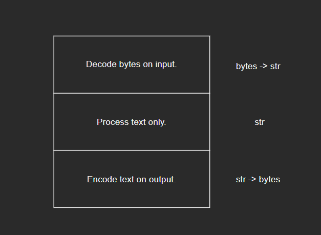
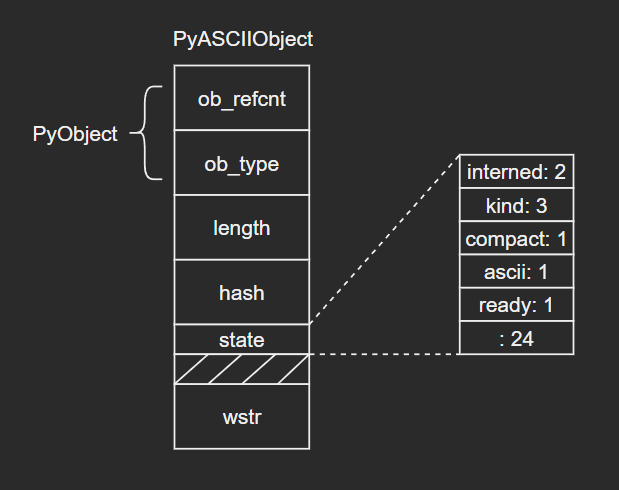
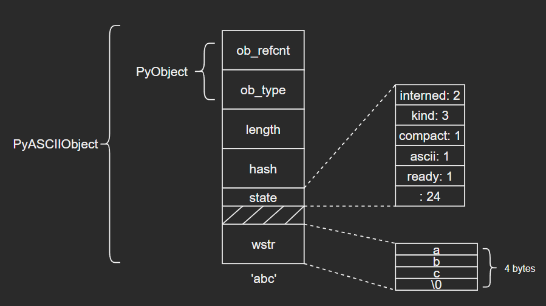
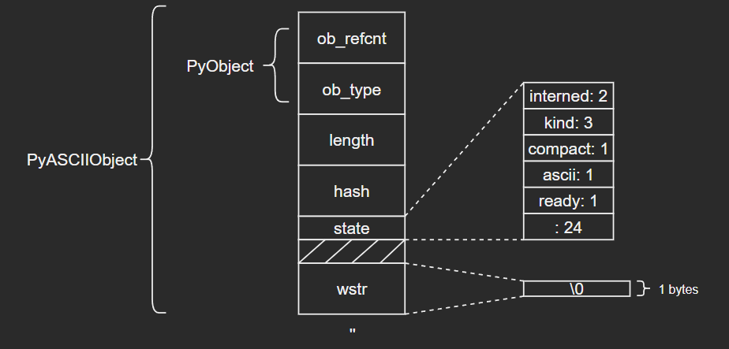
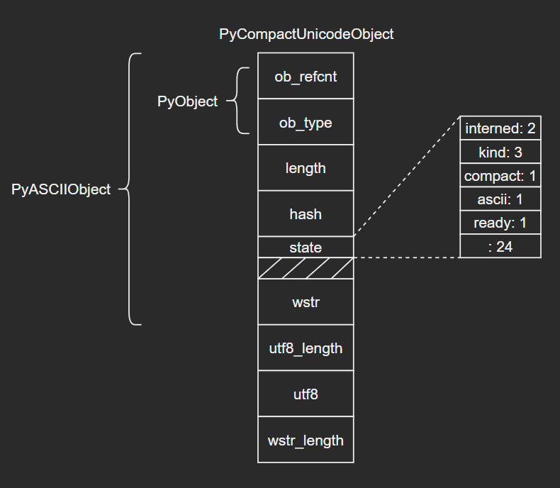

# 深入认识Python内建类型——str

注：本篇是根据教程学习记录的笔记，部分内容与教程是相同的，因为转载需要填链接，但是没有，所以填的原创，如果侵权会直接删除。

在介绍常用类型str之前，在上一篇博客（“7-深入认识Python内建类型——bytes”）已经为大家介绍了和str息息相关的bytes的源码知识。这篇博客会为大家分析str相关的源码。

## 1 Unicode

- 计算机存储的基本单位是**字节**，由8个比特位组成。由于英文只由26个字母加若干符号组成，因此英文字符可以直接用字节来保存。但是其他语言（例如中日韩等），由于字符众多，不得不使用多个字节来进行编码。
- 随着计算机技术的传播，非拉丁文字符编码技术不断发展，但是仍然存在两个比较大的局限性：
  - 不支持多语言：一种语言的编码方案不能用于另外一种语言
  - 没有统一标准：例如中文就有GBK、GB2312、GB18030等多种编码标准
- 由于编码方式不统一，开发人员就需要在不同编码之间来回转换，不可避免地会出现很多错误。为了解决这类不统一问题，Unicode标准被提出了。Unicode对世界上大部分文字系统进行整理、编码，让计算机可以用统一的方式处理文本。Unicode目前已经收录了超过14万个字符，天然地支持多语言。（Unicode的uni就是“统一”的词根）

## 2 Python中的Unicode

### 2.1 Unicode对象的好处

- Python在3之后，str对象内部改用Unicode表示，因此在源码中成为**Unicode对象**。使用Unicode表示的好处是：程序核心逻辑统一使用Unicode，只需在输入、输出层进行解码、编码，可最大程度地避免各种编码问题。

- 图示如下：

  

### 2.2 Python对Unicode的优化

问题：由于Unicode收录字符已经超过14万个，每个字符至少需要4个字节来保存（`这里应该是因为2个字节不够，所以才用4个字节，一般不会使用3个字节`）。而英文字符用ASCII码表示仅需要1个字节，使用Unicode反而会使频繁使用的英文字符的开销变为原来的4倍。

- 首先我们来看一下Python中不同形式的str对象的大小差异：

  ```python
  >>> sys.getsizeof('ab') - sys.getsizeof('a')
  1
  >>> sys.getsizeof('一二') - sys.getsizeof('一')
  2
  >>> sys.getsizeof('😄😄') - sys.getsizeof('😄')
  4
  ```

  由此可见，Python内部对Unicode对象进行了优化：根据文本内容，选择底层存储单元。

- Unicode对象底层存储根据文本字符的Unicode码位范围分成三类：

  - PyUnicode_1BYTE_KIND：所有字符码位在U+0000到U+00FF之间
  - PyUnicode_2BYTE_KIND：所有字符码位在U+0000到U+FFFF之间，且至少有一个字符的码位大于U+00FF
  - PyUnicode_1BYTE_KIND：所有字符码位在U+0000到U+10FFFF之间，且至少有一个字符的码位大于U+FFFF

  对应枚举如下：

  ```c
  enum PyUnicode_Kind {
  /* String contains only wstr byte characters.  This is only possible
     when the string was created with a legacy API and _PyUnicode_Ready()
     has not been called yet.  */
      PyUnicode_WCHAR_KIND = 0,
  /* Return values of the PyUnicode_KIND() macro: */
      PyUnicode_1BYTE_KIND = 1,
      PyUnicode_2BYTE_KIND = 2,
      PyUnicode_4BYTE_KIND = 4
  };
  ```

  根据不同的分类，选择不同的存储单元：

  ```c
  /* Py_UCS4 and Py_UCS2 are typedefs for the respective
     unicode representations. */
  typedef uint32_t Py_UCS4;
  typedef uint16_t Py_UCS2;
  typedef uint8_t Py_UCS1;
  ```

  对应关系如下：

  | 文本类型             | 字符存储单元 | 字符存储单元大小（字节） |
  | -------------------- | ------------ | ------------------------ |
  | PyUnicode_1BYTE_KIND | Py_UCS1      | 1                        |
  | PyUnicode_2BYTE_KIND | Py_UCS2      | 2                        |
  | PyUnicode_4BYTE_KIND | Py_UCS4      | 4                        |

- 由于Unicode内部存储结构因文本类型而异，因此类型kind必须作为Unicode对象公共字段进行保存。Python内部定义了一些标志位，作为Unicode公共字段：（介于笔者水平有限，这里的字段在后续内容中不会全部介绍，大家后续可以自行了解。抱拳~）

  - interned：是否为interned机制维护
  - kind：类型，用于区分字符底层存储单元大小
  - compact：内存分配方式，对象与文本缓冲区是否分离
  - asscii：文本是否均为纯ASCII

- 通过PyUnicode_New函数，根据文本字符数size以及最大字符maxchar初始化Unicode对象。该函数主要是根据maxchar为Unicode对象选择最紧凑的字符存储单元以及底层结构体：（源码比较长，这里就不列出了，大家可以自行了解，下面以表格形式展现）

  |                          | maxchar < 128        | 128 <= maxchar < 256   | 256 <= maxchar < 65536 | 65536 <= maxchar < MAX_UNICODE |
  | ------------------------ | -------------------- | ---------------------- | ---------------------- | ------------------------------ |
  | kind                     | PyUnicode_1BYTE_KIND | PyUnicode_1BYTE_KIND   | PyUnicode_2BYTE_KIND   | PyUnicode_4BYTE_KIND           |
  | ascii                    | 1                    | 0                      | 0                      | 0                              |
  | 字符存储单元大小（字节） | 1                    | 1                      | 2                      | 4                              |
  | 底层结构体               | PyASCIIObject        | PyCompactUnicodeObject | PyCompactUnicodeObject | PyCompactUnicodeObject         |

## 3 Unicode对象的底层结构体

### 3.1 PyASCIIObject

- C源码：

  ```c
  typedef struct {
      PyObject_HEAD
      Py_ssize_t length;          /* Number of code points in the string */
      Py_hash_t hash;             /* Hash value; -1 if not set */
      struct {
          unsigned int interned:2;
          unsigned int kind:3;
          unsigned int compact:1;
          unsigned int ascii:1;
          unsigned int ready:1;
          unsigned int :24;
      } state;
      wchar_t *wstr;              /* wchar_t representation (null-terminated) */
  } PyASCIIObject;
  ```
  
- 源码分析：

  - length：文本长度
  - hash：文本哈希值
  - state：Unicode对象标志位
  - wstr：缓存C字符串的一个wchar_t指针，以“\0”结束（`这里和我看的另一篇文章讲得不太一样，另一个描述是：ASCII文本紧接着位于PyASCIIObject结构体后面，我个人觉得现在的这种说法比较准确，毕竟源码结构体后面没有别的字段了`）

- 图示如下：

  （注意这里state字段后面有一个4字节大小的空洞，这是结构体字段内存对齐造成的现象，主要是为了优化内存访问效率）

  

- ASCII文本由wstr指向，以'abc'和空字符串对象''为例：

  

  

### 3.2 PyCompactUnicodeObject

- 如果文本不全是ASCII，Unicode对象底层便由PyCompactUnicodeObject结构体保存。C源码如下：

  ```c
  /* Non-ASCII strings allocated through PyUnicode_New use the
     PyCompactUnicodeObject structure. state.compact is set, and the data
     immediately follow the structure. */
  typedef struct {
      PyASCIIObject _base;
      Py_ssize_t utf8_length;     /* Number of bytes in utf8, excluding the
                                   * terminating \0. */
      char *utf8;                 /* UTF-8 representation (null-terminated) */
      Py_ssize_t wstr_length;     /* Number of code points in wstr, possible
                                   * surrogates count as two code points. */
  } PyCompactUnicodeObject;
  ```

  PyCompactUnicodeObject在PyASCIIObject的基础上增加了3个字段：

  - utf8_length：文本UTF8编码长度
  - utf8：文本UTF8编码形式，缓存以避免重复编码运算
  - wstr_length：wstr的“长度”（`这里所谓的长度没有找到很准确的说法，笔者也不太清楚怎么能打印出来，大家可以自行研究下`）

  注意到，PyASCIIObject中并没有保存UTF8编码形式，这是因为ASCII本身就是合法的UTF8，这也是ASCII文本底层由PyASCIIObject保存的原因。

- 结构图示：

  

### 3.3 PyUnicodeObject

PyUnicodeObject则是Python中str对象的具体实现。C源码如下：

```c
/* Strings allocated through PyUnicode_FromUnicode(NULL, len) use the
   PyUnicodeObject structure. The actual string data is initially in the wstr
   block, and copied into the data block using _PyUnicode_Ready. */
typedef struct {
    PyCompactUnicodeObject _base;
    union {
        void *any;
        Py_UCS1 *latin1;
        Py_UCS2 *ucs2;
        Py_UCS4 *ucs4;
    } data;                     /* Canonical, smallest-form Unicode buffer */
} PyUnicodeObject;
```

### 3.4 示例

在日常开发时，要结合实际情况注意字符串拼接前后的内存大小差别：

```python
>>> import sys
>>> text = 'a' * 1000
>>> sys.getsizeof(text)
1049
>>> text += '😄'
>>> sys.getsizeof(text)
4080
```

## 4 interned机制

- 如果str对象的interned标志位为1，Python虚拟机将为其开启**interned机制**，源码如下：（`相关信息在网上可以看到很多说法和解释，这里笔者能力有限，暂时没有找到最确切的答案，之后补充。抱拳~但是我们通过分析源码应该是能看出一些门道的`）

  ```c
  /* This dictionary holds all interned unicode strings.  Note that references
     to strings in this dictionary are *not* counted in the string's ob_refcnt.
     When the interned string reaches a refcnt of 0 the string deallocation
     function will delete the reference from this dictionary.
  
     Another way to look at this is that to say that the actual reference
     count of a string is:  s->ob_refcnt + (s->state ? 2 : 0)
  */
  static PyObject *interned = NULL;
  
  void
  PyUnicode_InternInPlace(PyObject **p)
  {
      PyObject *s = *p;
      PyObject *t;
  #ifdef Py_DEBUG
      assert(s != NULL);
      assert(_PyUnicode_CHECK(s));
  #else
      if (s == NULL || !PyUnicode_Check(s))
          return;
  #endif
      /* If it's a subclass, we don't really know what putting
         it in the interned dict might do. */
      if (!PyUnicode_CheckExact(s))
          return;
      if (PyUnicode_CHECK_INTERNED(s))
          return;
      if (interned == NULL) {
          interned = PyDict_New();
          if (interned == NULL) {
              PyErr_Clear(); /* Don't leave an exception */
              return;
          }
      }
      Py_ALLOW_RECURSION
      t = PyDict_SetDefault(interned, s, s);
      Py_END_ALLOW_RECURSION
      if (t == NULL) {
          PyErr_Clear();
          return;
      }
      if (t != s) {
          Py_INCREF(t);
          Py_SETREF(*p, t);
          return;
      }
      /* The two references in interned are not counted by refcnt.
         The deallocator will take care of this */
      Py_REFCNT(s) -= 2;
      _PyUnicode_STATE(s).interned = SSTATE_INTERNED_MORTAL;
  }
  ```

  可以看到，源码前面还是做一些基本的检查。我们可以看一下37行和50行：将s添加到interned字典中时，其实s同时是key和value（`这里我不太清楚为什么会这样做`），所以s对应的引用计数是+2了的（具体可以看PyDict_SetDefault()的源码），所以在50行时会将计数-2，保证引用计数的正确。

- 考虑下面的场景：

  ```python
  >>> class User:
      def __init__(self, name, age):
          self.name = name
          self.age = age
  >>> user = User('Tom', 21)
  >>> user.__dict__
  {'name': 'Tom', 'age': 21}
  ```

  由于对象的属性由dict保存，这意味着每个User对象都要保存一个str对象‘name'，这会浪费大量的内存。而str是不可变对象，因此Python内部将有潜在重复可能的字符串都做成单例模式，这就是interned机制。Python具体做法就是在内部维护一个全局dict对象，所有开启interned机制的str对象均保存在这里，后续需要使用的时候，先创建，如果判断已经维护了相同的字符串，就会将新创建的这个对象回收掉。

- 示例：

  由不同运算生成'abc'，最后都是同一个对象：

  ```python
  >>> a = 'abc'
  >>> b = 'ab' + 'c'
  >>> id(a), id(b), a is b
  (2752416949872, 2752416949872, True)
  ```

## 5 总结

**个人反思**：`在写这篇博客时查阅了很多资料，看到了很多已有的但是不同的说法，在整理学习的时候感觉有些吃力，不过尽可能地没有直接输出不确切的观点，而是基于真正的源码来为大家分析。并且str的相关内容应该是目前为止内建类型中最多最杂的，后续会补充的list和dict的相关内容都比它要清晰明确，当然其中最大的问题肯定还是笔者的能力。博客中应该还是有错误和不足的地方，但尽量对源码部分的解释做到准确。目前笔者能力有限，今后进步之后再对该篇博客中错误和不足的地方进行修正补充。抱拳~`
