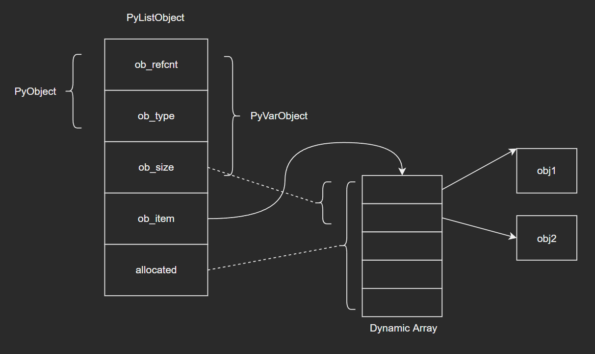
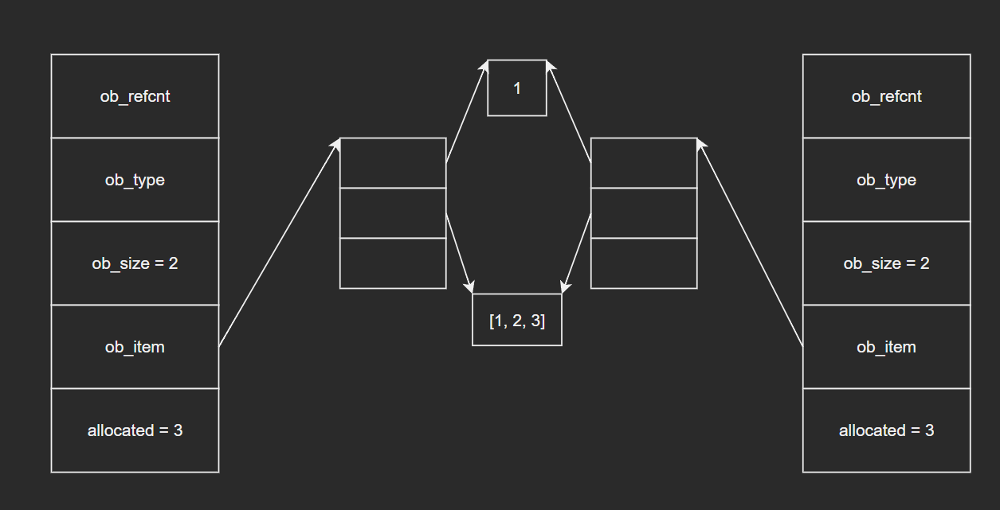
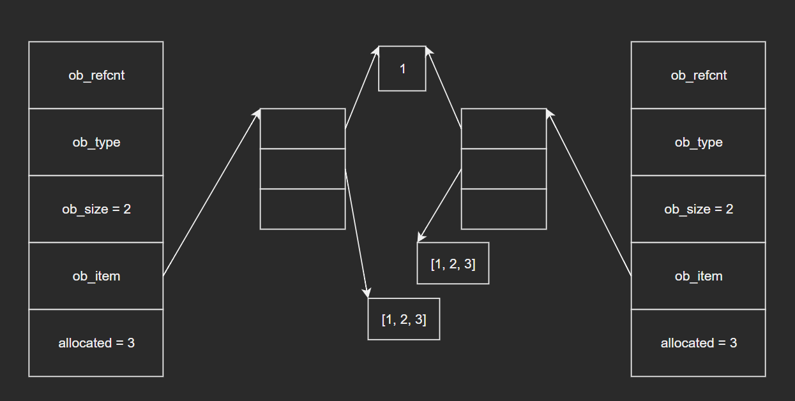
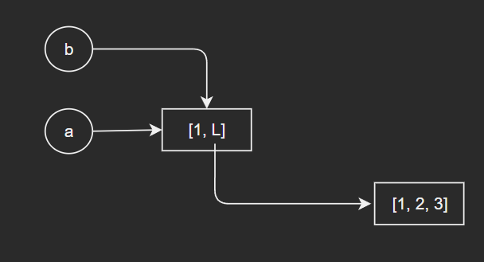
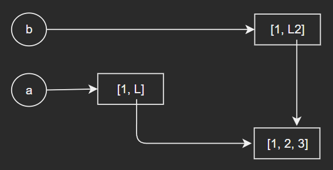
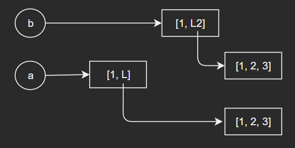
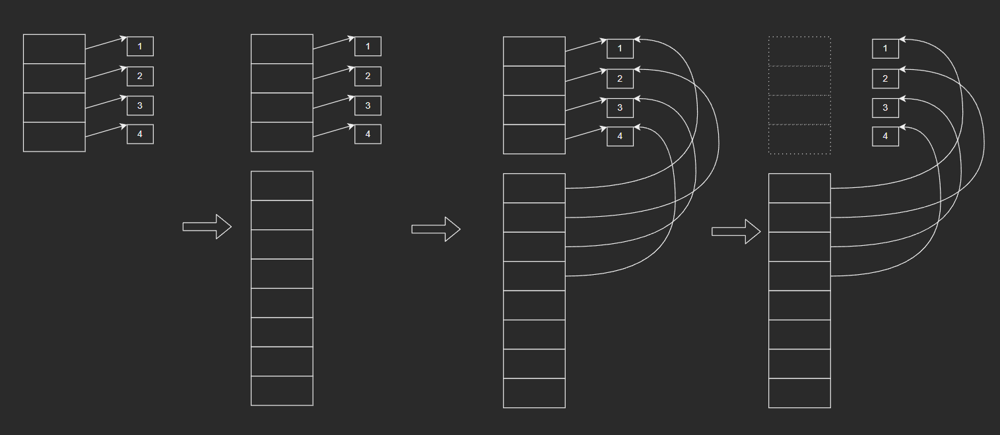

# 深入认识Python内建类型——list

注：本篇是根据教程学习记录的笔记，部分内容与教程是相同的，因为转载需要填链接，但是没有，所以填的原创，如果侵权会直接删除。

list是日常开发中最常用的内建类型之一，掌握好它的底层知识，无论是对数据结构基础知识的理解，还是对开发效率的提升，应该都是有一定帮助的

问题：

- list对象支持哪些操作？时间复杂度、空间复杂度分别是多少？
- 试分析append和insert这两个典型方法的时间复杂度。
- 头部添加元素时性能较差，如何解决？

## 1 常用方法

大家对于list应该是比较熟悉的，我们先列举一些常用的方法：

- append：向尾部追加元素

  ```python
  >>> l = [1, 2, 3]
  >>> l.append(4)
  >>> l
  [1, 2, 3, 4]
  ```

- pop：弹出元素（默认从尾部弹出元素，也可以通过index参数从指定位置弹出）

  ```python
  >>> l = [1, 2, 3, 4]
  >>> l.pop()
  4
  >>> l
  [1, 2, 3]
  ```

  ```python
  >>> l = [1, 2, 3, 4]
  >>> l.pop(0)  # 指定index
  1
  >>> l
  [2, 3, 4]
  ```

- insert：在指定位置插入元素

  ```python
  >>> l = [1, 2, 3]
  >>> l.insert(0, 4)
  >>> l
  [4, 1, 2, 3]
  ```

- index：查找指定元素第一次出现位置的下标

  ```python
  >>> l = [1, 2, 3, 4]
  >>> l.index(1)
  0
  ```

- extend：用一个可迭代对象扩展列表——元素逐一追加到尾部

  ```python
  >>> l = [1, 2, 3]
  >>> l.extend({1: 2, 3: 4})
  >>> l
  [1, 2, 3, 1, 3]
  ```

- count：计算元素出现的次数

  ```python
  >>> l = [1, 2, 3, 1]
  >>> l.count(1)
  2
  >>> l.count(2)
  1
  ```

- reverse：将列表反转（注意这里是直接在原列表上进行操作，可以和切片区分下）

  ```python
  >>> l = [1, 2, 3]
  >>> l.reverse()
  >>> l
  [3, 2, 1]
  ```

- clear：将列表清空

  ```python
  >>> l = [1, 2, 3]
  >>> l.clear()
  >>> l
  []
  ```

小结：list的操作总体比较简单，但是要注意的是：由于list底层是由数组实现的，对应的各类插入和删除操作就会由于数组的特型而在复杂度上有所差别，例如：通过insert()在头部插入元素时，需要挪动整个列表，此时时间复杂度为O(n)，而append()直接在尾部插入元素时，时间复杂度为O(1)。在使用时要注意时空复杂度问题（后续我会结合源码详细介绍）。

`题外话`：list的操作有很多，后续我会对典型操作进行源码分析，还有很多操作可能就需要大家自行去学习了解了，但是本质上都是大同小异的，掌握好数组以及Python对此在源码处理上的一些技巧就能熟练掌握了。这里我结合自己的学习、工作、面试经历，总结了一点问题和心得：

1. list为什么可以使用负数索引——从源码角度看是因为判断了索引输入为负数的情况，会做一个相应的处理：索引值+列表长度。例如：索引为-1，列表长度为3，最终的索引就是2，也就是最后一个元素的索引。对比一下Java中的数组，如果使用负数索引，会报错索引越界，在网上查能否有相关方法实现负数索引：有人说用一个类来包装，也有的说用一个字典去映射负数和正确的索引，也有的直接给出了无法做到的答案。相关的做法应该是有很多的，但同时也不要忽视了安全性等相关问题。这里提出这个点也是我自己觉得比较有趣的一个地方吧，“索引值+列表长度”其实是一个很简单的做法，但总感觉又有那么一点一般人想不出来的巧妙，hh
2. 以pop()和insert()为例，这两个方法有一个共同的参数：索引。对于pop()，如果索引值大于等于列表长度，则会报错；而对于insert()，如果索引值大于等于列表长度则统一将元素插入到列表最后。从源码角度看其实就是insert()对于索引参数做了一个判断处理，当它大于列表长度时，会将索引值更改为列表长度，例如：index = 5，而list = [1, 2, 3]，源码处理时，会将index置为3。所以如果开发者乐意的话，应该可以对pop()也采用相同的操作，我个人认为这里应该是有其他的考虑的，例如安全性等问题，当然也有可能只是写成了这样而已，hh
3. reverse()，reversed()，切片的区别。个人认为本质上这三者其实没啥关系，大家如果容易弄混可能还是因为不够熟练。重点问题可能在切片以及深拷贝、浅拷贝的问题上，后续我会详细介绍相关内容。
4. append()和extend()的区别。面试题好像会问这个，也是很基础的知识了。如果换个角度问可能会更有趣些：l.append(3)和l.extend(3)的效果是不是一样的？答：不一样，后者会直接报错，hh

`不知不觉就写了这么多，相比上次写str相关的内容还是要顺畅多了（捂脸）。相关的小知识应该是还有很多的，大家可以在学习的过程中多找一些问题和资料来融会贯通，当然我个人认为如果能把底层的逻辑搞清楚，其他的应该都不成问题~`

## 2 list的内部结构：PyListObject

- 源码如下：

  ```c
  typedef struct {
      PyObject_VAR_HEAD
      /* Vector of pointers to list elements.  list[0] is ob_item[0], etc. */
      PyObject **ob_item;
  
      /* ob_item contains space for 'allocated' elements.  The number
       * currently in use is ob_size.
       * Invariants:
       *     0 <= ob_size <= allocated
       *     len(list) == ob_size
       *     ob_item == NULL implies ob_size == allocated == 0
       * list.sort() temporarily sets allocated to -1 to detect mutations.
       *
       * Items must normally not be NULL, except during construction when
       * the list is not yet visible outside the function that builds it.
       */
      Py_ssize_t allocated;
  } PyListObject;
  ```

- 源码分析：

  - ob_item：二维指针，指向动态数组的指针，数组保存元素对象指针
  - allocated：动态数组总长度，即列表当前的容量
  - ob_size：当前元素个数，即列表当前的长度

- 这里出现了一些新的概念：动态数组，容量。后续我会对此进行介绍，这里大家对照示意图应该就能有比较初步的认识了：

  

## 3 尾部操作和头部操作

认识了list的底层结构之后，这里在强调一下尾部操作和头部操作的一些问题，巩固一下数组相关的数据结构知识，也顺便引出一些动态数组的相关内容。

### 3.1 尾部操作

- 假设列表对象 l 内部数组长度为5，当前保存了2个元素，分别是1，2。当我们调用append()方法向尾部追加元素时，由于内部数组还未用满，只需将新元素保存于下一个可用位置，并更新ob_size字段。因此，绝大多数情况下，append()方法的性能都足够好，时间复杂度为O(1)。
- 若list对象内部数组已满，则再添加元素时就需要进行**扩容**。append()等方法在操作时都会对内部数组进行检查，如需扩容，则会**重新分配**一个长度更大的数组并替换旧数组。因此，当使用append()方法遇到扩容时，会将列表元素从旧数组拷贝到新数组，此时时间复杂度为O(n)。

`个人想法：这里引出这个问题是因为我个人当时在学习到这个知识点时，意识到了一个问题：怎么扩容。如果没记错的话Java面试题中也会经常闻到动态扩容。这里抛开面试不谈，我的想法主要是在怎么去避免频繁扩容，毕竟扩容一次就需要拷贝所有的元素。这在日常开发中应该也是一个需要大家关注的问题：像这种类似的消耗突增的操作，我们需要去避免，降低它的触发频率，但同时也不能忽视时空上的消耗。`

### 3.2 头部操作

- 与尾部相比，由于在列表头部增删元素需要挪动其他元素，性能差别就很大了（数组的基础知识）

- 这里既然提到了头部操作，我们来看一下Python中的队列：

  - 通过list实现栈是很好的，但是用来实现队列是很不合理的：（LeetCode上的用栈实现队列除外，hh）

    ```python
    q = []
    
    
    q.append(1)
    q.append(2)
    q.append(3)
    
    # deque
    q.pop(0)
    ```

    这样的队列实现，在出队操作时会移动所有队列元素（除pop掉的元素以外），性能很差

  - 如果需要频繁进行头部操作，可以使用标准库中的deque，这是一种双端队列结构：

    ```python
    from collections import deque
    q = deque()
    
    # enqueue
    q.append(job)
    
    # deque
    q.popleft()
    ```

## 4 浅拷贝和深拷贝

浅拷贝和深拷贝应该是容器相关的一个比较重要的知识点了，无论是Python还是Java中都会涉及，面试中应该也比较常见。（其实可以单独写一篇博客来介绍这部分内容，这里就先放在了list中来介绍，后续会考虑重新总结归纳出一篇博客）

### 4.1 浅拷贝

- 调用list对象的copy方法，可以将列表拷贝一份，生成一个新的列表，但是不会拷贝列表中的元素。结合源码来说就是：会拷贝一下底层数组中指向具体元素对象的指针，但是元素对象不会被拷贝。

- 下面通过对浅拷贝后的列表进行修改来实际体会一下：

  示例1：

  ```python
  >>> l1 = [1, [1, 2, 3]]
  >>> l1
  [1, [1, 2, 3]]
  # 浅拷贝
  >>> l2 = l1.copy()
  >>> l2
  [1, [1, 2, 3]]
  # 修改新列表中的可变元素
  >>> l2[1][0] = 6
  >>> l2
  [1, [6, 2, 3]]
  >>> l1
  [1, [6, 2, 3]]
  ```

  示例2：

  ```python
  >>> l1 = [1, [1, 2, 3]]
  >>> l1
  [1, [1, 2, 3]]
  # 浅拷贝
  >>> l2 = l1.copy()
  >>> l2
  [1, [1, 2, 3]]
  # 修改新列表中的不可变元素
  >>> l2[0] = 2
  >>> l2
  [2, [1, 2, 3]]
  >>> l1
  [1, [1, 2, 3]]
  ```

  示例3：

  ```python
  >>> l1 = [1, [1, 2, 3]]
  >>> l1
  [1, [1, 2, 3]]
  # 浅拷贝
  >>> l2 = l1.copy()
  >>> l2
  [1, [1, 2, 3]]
  # 这里要注意并没有修改可变元素[1, 2, 3]，而是将l2[1]处的指针修改了，指向了一个新对象[3, 4]
  >>> l2[1] = [3, 4]
  >>> l2
  [2, [3, 4]]
  >>> l1
  [1, [1, 2, 3]]
  ```

- list对象的底层数组保存的是元素对象的指针，copy()方法复制底层数组时，拷贝的也是元素对象的指针，而不会拷贝具体的元素对象。因此，新旧列表对象的数组中的指针指向的还是相同的对象。图示如下：

  

### 4.2 深拷贝

- 通过copy模块中的deepcopy()函数可以进行深拷贝，deepcopy()函数会递归复制所有容器对象，确保新旧列表不会包含同一个容器对象（`这里要注意元组是比较特殊的，稍微会说明`）

- 下面通过对深拷贝后的列表进行修改来实际体会一下：

  ```python
  >>> from copy import deepcopy
  >>> l1 = [1, [1, 2, 3]]
  >>> l1
  [1, [1, 2, 3]]
  # 深拷贝
  >>> l2 = deepcopy(l1)
  >>> l2
  [1, [1, 2, 3]]
  >>> l2[1][0] = 5
  >>> l2
  [1, [5, 2, 3]]
  >>> l1
  [1, [1, 2, 3]]
  >>> l2[0] = 2
  >>> l2
  [2, [5, 2, 3]]
  >>> l1
  [1, [1, 2, 3]]
  ```

- 图示如下：

  

### 4.3 直接赋值

除了深拷贝、浅拷贝外，最常见的操作就是直接赋值，即对象的引用（别名），这里就不涉及到复制操作了。

### 4.4 小结

1. 直接赋值：b = a

   

2. 浅拷贝：b = a.copy()

   
   
3. 深拷贝：b = copy.deepcopy(a)

   

`个人总结：`弄清楚list底层数组中存储的是指向对应元素的指针，以及深拷贝时的递归，我觉得就能对相关的知识点有一个比较清晰的认识了。但是对于Python中的元组需要特殊考虑，它是一个不可变的容器，当元组中含有可变数据类型的容器和不含时，深拷贝的情况是有区别的。本质上元组是不会去创建新对象的，因为它不可变（这里我没有找到百分百的证据，主要是根据经验和查到的资料，大家可以去看一下源码），但是当元组中还有可变数据类型的容器，就又会由于深拷贝递归去拷贝相应的对象而导致重新创建一个新的元组对象。这里可能比较绕，大家可以自行去打印看一下结果。但是我个人觉得核心就是“弄清楚list底层数组中存储的是指向对应元素的指针，以及深拷贝时的递归”。

`TODO：`后续我会重新写一篇博客来专门将深浅拷贝的源码列出来，来看看为什么对于元组就会特殊处理。要是我们的列表元素是自定义的数据类型又是如何处理的。深拷贝递归复制时判断的条件到底是如何写的。

## 5 动态数组

这一部分的内容也是这篇博客最主要的重点：分析list底层数组的特性。前面我们已经介绍了list的常用操作、底层结构，以及以list为例简单介绍了深浅拷贝。这一小节会结合源码详细介绍list底层动态数组的特性，我个人觉得这一设计也传达了我们在业务开发上的一个比较常用和关键的思想。

### 5.1 容量调整

- 前面已经提到，当我们调用append()、pop()、insert()等方法时，列表长度会发生变化。当列表长度超过底层数组容量时，便需要对底层数组进行**扩容**；当列表长度低于底层数组容量并且达到某个值时，便需要对底层数组进行**缩容**。

- append()等方法是依赖list_resize()函数来调整列表长度的。源码如下：

  ```c
  static int
  list_resize(PyListObject *self, Py_ssize_t newsize)
  {
      PyObject **items;
      size_t new_allocated, num_allocated_bytes;
      Py_ssize_t allocated = self->allocated;
  
      /* Bypass realloc() when a previous overallocation is large enough
         to accommodate the newsize.  If the newsize falls lower than half
         the allocated size, then proceed with the realloc() to shrink the list.
      */
      if (allocated >= newsize && newsize >= (allocated >> 1)) {
          assert(self->ob_item != NULL || newsize == 0);
          Py_SIZE(self) = newsize;
          return 0;
      }
  
      /* This over-allocates proportional to the list size, making room
       * for additional growth.  The over-allocation is mild, but is
       * enough to give linear-time amortized behavior over a long
       * sequence of appends() in the presence of a poorly-performing
       * system realloc().
       * The growth pattern is:  0, 4, 8, 16, 25, 35, 46, 58, 72, 88, ...
       * Note: new_allocated won't overflow because the largest possible value
       *       is PY_SSIZE_T_MAX * (9 / 8) + 6 which always fits in a size_t.
       */
      new_allocated = (size_t)newsize + (newsize >> 3) + (newsize < 9 ? 3 : 6);
      if (new_allocated > (size_t)PY_SSIZE_T_MAX / sizeof(PyObject *)) {
          PyErr_NoMemory();
          return -1;
      }
  
      if (newsize == 0)
          new_allocated = 0;
      num_allocated_bytes = new_allocated * sizeof(PyObject *);
      items = (PyObject **)PyMem_Realloc(self->ob_item, num_allocated_bytes);
      if (items == NULL) {
          PyErr_NoMemory();
          return -1;
      }
      self->ob_item = items;
      Py_SIZE(self) = newsize;
      self->allocated = new_allocated;
      return 0;
  }
  ```

- 源码分析：

  - 重要参数：

    1. items指针：用于保存新数组
    2. new_allocated：用于保存新数组容量
    3. num_allocated_bytes：用于保存新数组内存大小，单位为字节
    4. allocated：用于保存旧数组容量

  - 重要步骤：

    1. 第12行：检查新长度与底层数组容量的大小关系。如果新长度不超过现有数组容量，并且大于等于现有容量的一半，则不会更新数组容量，只修改ob_size即可。从这里我们可以得知list对象的扩缩容条件：
       - 扩容条件：新长度大于底层数组容量
       - 缩容条件：新长度小于底层数组容量的一半
    2. 第27行：新容量=新长度+1/8*新长度+3或6（取决于新长度是否小于9）
    3. 第28~31行：如果新容量超过了允许的最大值，则返回错误
    4. 第33~34行：如果新长度为0，则新容量也为0，此时底层数组为空
    5. 第36~40行：调用PyMem_Realloc()函数重新分配底层数组
    6. 第41~44行：依次设置新底层数组、新长度、新容量

  - 注：

    - 在扩容时先增加1/8，再增加3或6，是为了有效限制扩容频率，避免list对象长度较小时会频繁扩容（我个人在工作中没有遇到需要考虑类似问题的需求，都是在写业务代码（捂脸），但是我认为这种思想还是值得学习的）

    - PyMem_Realloc()函数是Python内部实现的内存管理函数之一，功能和C的库函数realloc()类似。主要步骤如下：

      ```c
      PyAPI_FUNC(void *) PyMem_Realloc(void *ptr, size_t new_size);
      ```

      1. 新申请一块大小为new_size的内存区域
      2. 将数据从旧内存区域ptr拷贝到新内存区域
      3. 释放旧内存区域ptr
      4. 返回新内存区域

      图示如下：

      

### 5.2 append()

- append()方法在Python内部由C函数list_append()实现，而list_append()进一步调用app1()函数完成元素追加

- app1()函数源码如下：

  ```c
  static int
  app1(PyListObject *self, PyObject *v)
  {
      Py_ssize_t n = PyList_GET_SIZE(self);
  
      assert (v != NULL);
      if (n == PY_SSIZE_T_MAX) {
          PyErr_SetString(PyExc_OverflowError,
              "cannot add more objects to list");
          return -1;
      }
  
      if (list_resize(self, n+1) < 0)
          return -1;
  
      Py_INCREF(v);
      PyList_SET_ITEM(self, n, v);
      return 0;
  }
  ```

- 源码分析：

  1. 第4行：调用PyList_GET_SIZE()获取列表当前长度，即ob_size
  2. 第7~11行：如果列表当前长度达到了最大值PY_SSIZE_T_MAX，则报错
  3. 第13~14行：调用list_resize()，必要时进行扩容
  4. 第16行：增加元素对象引用计数（这里是列表引用了该元素对象）
  5. 第17行：调用PyList_SET_ITEM()将元素对象指针保存在列表的最后一个位置

### 5.3 insert()

- insert()方法在Python内部由C函数list_insert_impl()实现，而list_insert_impl()进一步调用ins1()函数完成元素插入

- ins1()函数源码如下：

  ```c
  static int
  ins1(PyListObject *self, Py_ssize_t where, PyObject *v)
  {
      Py_ssize_t i, n = Py_SIZE(self);
      PyObject **items;
      if (v == NULL) {
          PyErr_BadInternalCall();
          return -1;
      }
      if (n == PY_SSIZE_T_MAX) {
          PyErr_SetString(PyExc_OverflowError,
              "cannot add more objects to list");
          return -1;
      }
  
      if (list_resize(self, n+1) < 0)
          return -1;
  
      if (where < 0) {
          where += n;
          if (where < 0)
              where = 0;
      }
      if (where > n)
          where = n;
      items = self->ob_item;
      for (i = n; --i >= where; )
          items[i+1] = items[i];
      Py_INCREF(v);
      items[where] = v;
      return 0;
  }
  ```

- 源码分析：

  1. 第19~25行：检查插入位置下标，如果下标为负数，则加上n将其转化为非负数。如果转化后的where值仍然小于0，则代表越界，但是这里会直接将where设置为0（即插入到列表头部），而没有报错。若下标为正数，也会判断是否越界，越界时则插入到列表尾部，同样不会报错。
  2. 第26~28行：将插入位置以后的元素逐一往后移动一个位置。（这里的for循环是从后往前迭代的）

### 5.4 pop()

- pop()方法将指定下标的元素从列表中弹出，下标默认为-1，即默认弹出最后一个元素

- pop()方法在Python内部由list_pop_impl()函数实现。源码如下：

  ```c
  static PyObject *
  list_pop_impl(PyListObject *self, Py_ssize_t index)
  /*[clinic end generated code: output=6bd69dcb3f17eca8 input=b83675976f329e6f]*/
  {
      PyObject *v;
      int status;
  
      if (Py_SIZE(self) == 0) {
          /* Special-case most common failure cause */
          PyErr_SetString(PyExc_IndexError, "pop from empty list");
          return NULL;
      }
      if (index < 0)
          index += Py_SIZE(self);
      if (index < 0 || index >= Py_SIZE(self)) {
          PyErr_SetString(PyExc_IndexError, "pop index out of range");
          return NULL;
      }
      v = self->ob_item[index];
      if (index == Py_SIZE(self) - 1) {
          status = list_resize(self, Py_SIZE(self) - 1);
          if (status >= 0)
              return v; /* and v now owns the reference the list had */
          else
              return NULL;
      }
      Py_INCREF(v);
      status = list_ass_slice(self, index, index+1, (PyObject *)NULL);
      if (status < 0) {
          Py_DECREF(v);
          return NULL;
      }
      return v;
  }
  ```

- 源码分析：

  1. 第12~13行：如果给定下标为负数，则加上列表长度，转化为普通下标
  2. 第14~16行：检查下标是否合法，如果越界则报错
  3. 第19~25行：如果待弹出元素为列表的尾部元素，则调用list_resize()直接处理（比较巧妙，hh）
  4. 第26~31行：其他情况下调用list_ass_slice()删除元素，调用前需要通过Py_INCREF增加元素的引用计数，因为在list_ass_slice()函数内部会释放被删除元素

### 5.5 remove()

- remove()方法将给定元素从列表中删除，与pop()不同，remove()直接删除给定元素，而不是通过下标进行索引

- remove()方法在Python内部由C函数list_remove()实现。源码如下：

  ```c
  static PyObject *
  list_remove(PyListObject *self, PyObject *value)
  /*[clinic end generated code: output=f087e1951a5e30d1 input=2dc2ba5bb2fb1f82]*/
  {
      Py_ssize_t i;
  
      for (i = 0; i < Py_SIZE(self); i++) {
          int cmp = PyObject_RichCompareBool(self->ob_item[i], value, Py_EQ);
          if (cmp > 0) {
              if (list_ass_slice(self, i, i+1,
                                 (PyObject *)NULL) == 0)
                  Py_RETURN_NONE;
              return NULL;
          }
          else if (cmp < 0)
              return NULL;
      }
      PyErr_SetString(PyExc_ValueError, "list.remove(x): x not in list");
      return NULL;
  }
  ```

- 源码分析：

  1. 第7行：通过for循环查找目标元素是否在列表中，若不在则会报错
  2. 第10行：通过list_ass_slice()删除指定元素

## 6 一些问题

1. 扩容时参数选择的依据？

   答：兼顾内存利用率和扩容频率。

2. 浅拷贝：

   ```python
   >>> l = [[1]] * 3
   >>> l
   [[1], [1], [1]]
   >>> l[0][0] = 5
   >>> l
   [[5], [5], [5]]
   
   >>> l = [[1]] + [[1]] + [[1]]
   >>> l
   [[1], [1], [1]]
   >>> l[0][0] = 5
   >>> l
   [[5], [1], [1]]
   ```

3. 声明一个空列表l = []，Python是如何为它分配空间的？

   答：对于这类问题，有两种策略：①预先分配一定大小的动态数组，对于最开始的增加元素操作不需要立即扩容；②开始时不分配动态数组，第一次添加元素时就会扩容。Python采用的是策略②，主要是为了将动态数组的分配推迟到真正需要的时刻，提高内存的使用效率。程序设计中的懒加载，操作系统的fork进程后采用的copy on write策略，指导思想都是类似的。（日常开发中这个思想应该也是有一定用处的）
